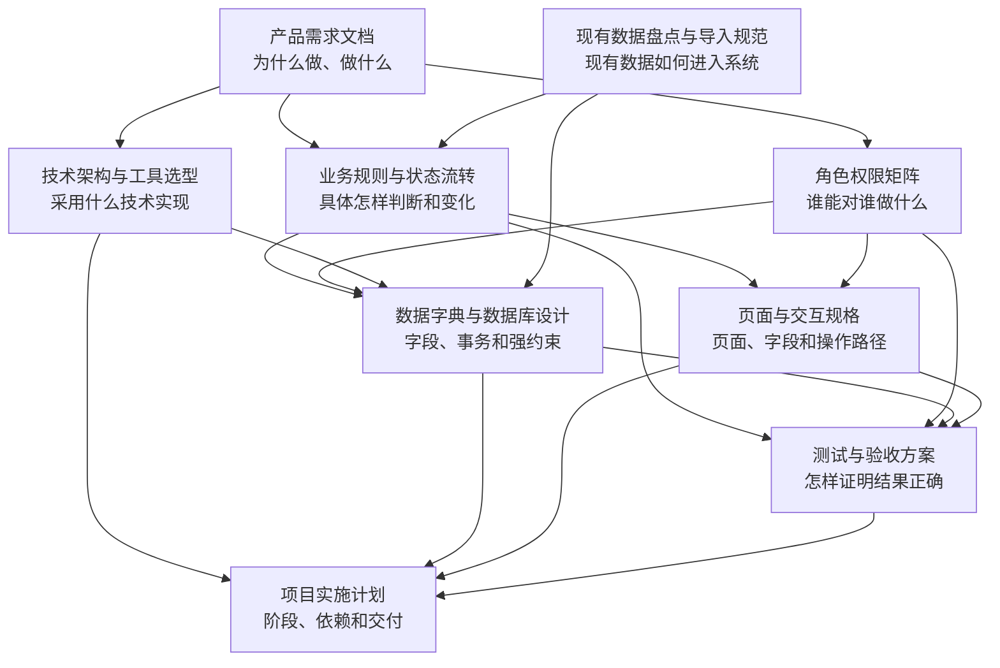

# 化妆部预约系统

化妆部预约系统用于替代现有 Excel 人工排班、自由文本登记、客服人工修改和拍照通知流程，从预约源头生成结构化、无冲突、可追溯的化妆排班。

当前阶段：**正式开发前的原型确认阶段**。九份正式文档和第一版可点击原型已经完成；正式业务代码尚未初始化，下一步是评审原型、确认少量外部选择并进入工程初始化。

---

## 1. 当前目录

```text
化妆部预约系统/
├─ README.md                 # 项目入口、文档导航和当前进度
├─ AGENTS.md                 # Codex和开发人员必须遵守的项目规范
├─ .gitignore                # 敏感数据、依赖、构建产物忽略规则
├─ docs/                     # 正式产品与技术文档
│  ├─ 产品需求文档.md
│  ├─ 业务规则与状态流转.md
│  ├─ 角色权限矩阵.md
│  ├─ 技术架构与工具选型.md
│  ├─ 数据字典与数据库设计.md
│  ├─ 现有数据盘点与导入规范.md
│  ├─ 页面与交互规格.md
│  ├─ 测试与验收方案.md
│  └─ 项目实施计划.md
├─ prototype/                # 使用模拟数据的可点击交互原型
└─ data/
   ├─ README.md              # 数据目录安全与使用说明
   └─ source/                # 五张本地Excel源文件，Git忽略
```

代码开工后再按需创建 `apps/`、`packages/`、`prisma/`、`scripts/` 和 `tests/`，不提前创建无内容的目录。

---

## 2. 推荐阅读顺序

1. [产品需求文档](docs/产品需求文档.md)：先理解目标、范围和完整业务场景。
2. [业务规则与状态流转](docs/业务规则与状态流转.md)：确认每个动作的精确条件、判断顺序和状态变化。
3. [角色权限矩阵](docs/角色权限矩阵.md)：确认谁能查看和操作哪些数据。
4. [技术架构与工具选型](docs/技术架构与工具选型.md)：了解系统如何实现、部署和扩展。
5. [数据字典与数据库设计](docs/数据字典与数据库设计.md)：了解表结构、事务、索引和并发约束。
6. [现有数据盘点与导入规范](docs/现有数据盘点与导入规范.md)：了解现有 Excel 的质量、迁移规则和数据边界。
7. [页面与交互规格](docs/页面与交互规格.md)：确认每个角色看到什么页面、怎样操作和怎样提示。
8. [测试与验收方案](docs/测试与验收方案.md)：确认怎样证明功能、权限、并发和数据结果正确。
9. [项目实施计划](docs/项目实施计划.md)：按里程碑安排开发、迁移、试点和上线。

可点击原型已私有发布：[打开“妆序”交互原型](https://zhuangxu-makeup-booking.kusento173.chatgpt.site)。原型只使用模拟数据，不连接真实人员名单、数据库或微信通知。

---

## 3. 九份正式文档的关系



### 3.1 产品需求文档

项目总纲，回答：

- 为什么要做系统。
- 有哪些角色、功能和业务场景。
- 第一阶段做到什么程度。
- 最终如何验收。

它定义产品范围，但不会把每条判断写成代码级规则。

### 3.2 业务规则与状态流转

产品需求的精确化，回答：

- 预约、改期、取消和请假按什么顺序判断。
- 每日两次、零点锁定和时间冲突如何执行。
- 固定、预约、请假和通知有哪些状态，怎样流转。
- 接口应返回什么稳定错误码。

后端领域服务和自动化测试主要以该文档为依据。

### 3.3 角色权限矩阵

业务规则的授权边界，回答：

- 主播、运营、化妆师、客服和管理员分别能做什么。
- 主播本人、运营负责范围、客服场地范围如何计算。
- 未分配运营时谁还能预约。
- 哪些字段可以展示，哪些敏感数据不能展示。

权限矩阵与业务规则共同决定一个操作能否成功。

### 3.4 技术架构与工具选型

实现总纲，回答：

- 前端、后端、数据库、队列和部署使用什么技术。
- 为什么第一期采用模块化单体而不是微服务。
- 项目代码如何分层和组织。
- 如何测试、监控、备份和使用 Git。

### 3.5 数据字典与数据库设计

架构和业务规则的数据落地，回答：

- 数据库有哪些表和字段。
- 如何保存人员、关系、班次、固定规则、预约、通知和审计历史。
- 如何用事务、排斥约束和唯一索引防止重复和冲突。
- 并发预约、改期、请假和审批如何保证一致性。

### 3.6 现有数据盘点与导入规范

现实数据到系统模型的桥梁，回答：

- 五张 Excel 的真实字段、数量和数据问题。
- 哪些数据导入、哪些数据留空、哪些文件仅保留参考。
- 导入模板、标准化、预检、确认和回滚规则。
- 首次迁移完成后如何验收。

当前决定：无法匹配运营主档的关系按未分配处理；固定主播名单不进入数据库。

### 3.7 页面与交互规格

把业务规则转换为手机端和 Web 后台页面，回答：

- 每个角色有哪些菜单、页面和操作入口。
- 预约、改期、固定、请假和审批具体怎样走。
- 表单展示什么字段，成功、失败、空状态和档期被抢怎样提示。
- 原型需要覆盖哪些关键闭环。

### 3.8 测试与验收方案

把需求转换为可执行的质量标准，回答：

- 单元、数据库、接口、端到端、并发、性能和安全分别测试什么。
- 每条核心业务和权限规则有哪些用例。
- 新旧排班怎样核对。
- 满足什么条件才允许试点和上线。

### 3.9 项目实施计划

把全部设计转换为执行顺序，回答：

- 项目按哪些里程碑推进。
- 每个阶段有哪些依赖、交付物和退出标准。
- 什么时候迁移、试点、回退和正式上线。
- 如何保证代码架构、自动化测试和 Git 提交质量。

---

## 4. 其他 Markdown 文件的职责

### `README.md`

只负责项目导航、目录说明和进度，不重复保存详细业务规则。

### `AGENTS.md`

属于开发执行规范，不是产品需求。它要求后续代码保持精简、高效、结构清晰、易测试和易维护，并规定敏感数据、测试及 Git 提交规则。

### `data/README.md`

只说明本地数据目录如何使用和保护，不记录人员明细。

---

## 5. 文档是否已经全面

### 已经完成

| 方面 | 状态 | 对应文档 |
|---|---|---|
| 项目目标与第一阶段范围 | 完成 | 产品需求文档 |
| 预约、固定、班次、请假和通知规则 | 完成 | 产品需求文档、业务规则与状态流转 |
| 五类角色和场地权限 | 完成 | 角色权限矩阵 |
| 技术栈和总体架构 | 完成 | 技术架构与工具选型 |
| 数据库表、事务、索引和并发约束 | 完成 | 数据字典与数据库设计 |
| 现有 Excel 盘点和迁移规则 | 完成 | 现有数据盘点与导入规范 |
| 手机端与 Web 页面、字段和交互 | 完成 | 页面与交互规格 |
| 功能、权限、并发、性能和上线验收 | 完成 | 测试与验收方案 |
| 开发阶段、依赖、试点和上线顺序 | 完成 | 项目实施计划 |
| 五类角色核心流程可点击原型 | 完成 | prototype |
| 代码质量和 Git 执行规范 | 完成 | AGENTS.md、技术架构与工具选型 |

结论：**正式开工前需要的文档基线已经全面，可以进入原型确认和工程初始化。** 后续接口、迁移、运维和用户手册属于随代码或上线阶段产生的活文档，不需要现在凭空写死。

### 正式开发前还需要完成的事项

可点击原型已经完成并通过构建、基础渲染测试和代码检查。

| 优先级 | 事项 | 解决的问题 |
|---|---|---|
| P0 | 外部选择记录 | 确认账号绑定和通知渠道等实现方式 |
| P0 | 原型评审结论 | 确认页面没有违反业务规则和权限 |

### 开发过程中再生成

| 文档/产物 | 生成时机 |
|---|---|
| OpenAPI 接口文档 | 后端接口开发时由 NestJS 自动生成 |
| 数据库迁移说明 | 每次 Prisma/PostgreSQL Migration 一起维护 |
| 部署与运维手册 | 第一版可以完整部署后编写并验证 |
| 用户操作手册 | 页面稳定并完成验收后编写 |

### 仍需业务确认的外部选择

1. 手机端最终确认继续采用当前推荐的微信小程序方案，还是改为微信内网页。
2. 首次账号绑定使用手机号、一次性绑定码还是组合方式。
3. 微信通知采用哪种可用渠道，以及失败时是否需要短信。
4. 加班待审核申请是否自动过期。
5. 排班 Excel 默认导出分场地文件还是合并文件。

这些选择不阻塞页面原型和代码骨架，但应在对应模块正式开发前确定。

---

## 6. 下一步

下一步由业务负责人、客服和各角色代表打开原型，依次走通主播第一次及第二次预约、运营固定申请、化妆师首次班次和请假、客服排班及审批。记录需要调整的页面和文案，形成原型评审结论后，按《项目实施计划》初始化正式代码工程。
