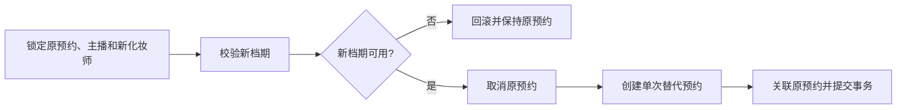
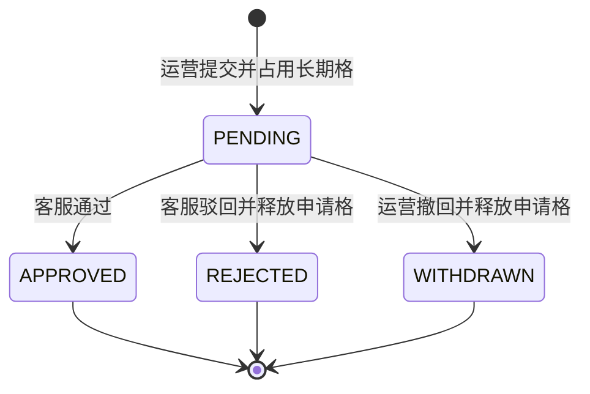
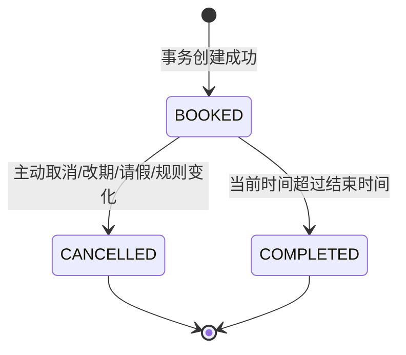
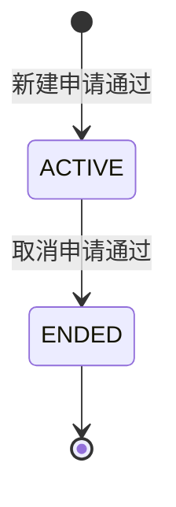
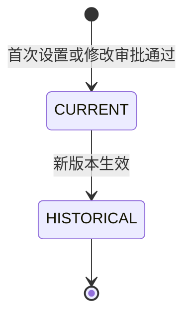
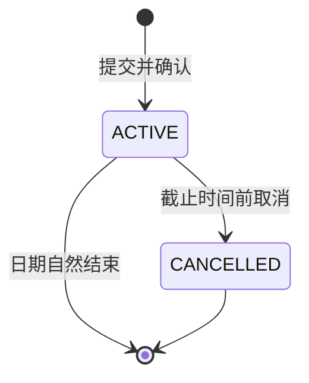

# 化妆部预约系统业务规则与状态流转

> 文档版本：V1.0｜编制日期：2026-07-20｜适用范围：产品、后端、前端、测试、数据迁移和客服操作

---

## 1. 文档定位

本文档把产品需求转换为可直接实现和测试的规则、判断顺序、状态机和异常码。代码中的业务规则必须集中在对应领域服务中，不能由前端、控制器、定时任务和数据库脚本分别维护不同版本。

文档职责：

- 《产品需求文档》说明系统要解决什么问题。
- 本文档说明每个业务动作在什么条件下允许、拒绝或产生后续影响。
- 《角色权限矩阵》说明谁能对谁执行这些动作。
- 《数据字典与数据库设计》说明规则如何落到字段、事务和数据库约束。

若规则发生变化，必须同时更新本文档、相关测试和受影响的产品文档，并创建独立 Git 提交。

---

## 2. 核心参数

| 参数 | 首期值 | 是否可配置 | 说明 |
|---|---:|---:|---|
| 业务时区 | `Asia/Shanghai` | 否 | 所有日期边界统一使用 |
| 预约起始日期 | 明天 | 否 | 当天只能查看 |
| 可预约窗口 | 未来 7 日 | 可在安全范围内配置 | 今天为 D，可预约 D+1～D+7 |
| 时间粒度 | 15 分钟 | 否 | 开始时间和班次时间均适用 |
| 可选时长 | 15、30、45、60 分钟 | 否 | 默认 30 分钟，最长 60 分钟 |
| 单主播每日上限 | 2 次 | 否 | 固定和单次共同计数 |
| 单次请假长度 | 最长 7 日 | 否 | 只能覆盖未来七日 |
| 固定预约生成窗口 | 至少未来 8 日 | 可增加 | 必须覆盖可预约窗口 |

任何配置变化都不能突破不可配置的业务上限。

---

## 3. 通用判断原则

| 规则 ID | 规则 |
|---|---|
| `COMMON-001` | 主播使用唯一主播编号识别，姓名允许重复，姓名不得作为授权或关系主键。 |
| `COMMON-002` | 所有时间区间采用左闭右开 `[开始, 结束)`，相邻区间不冲突。 |
| `COMMON-003` | 前端展示不占用档期，只有数据库事务成功提交才算预约成功。 |
| `COMMON-004` | 同一化妆师重叠档期按数据库成功写入顺序先到先得。 |
| `COMMON-005` | 改期和换化妆师不得覆盖原预约，必须取消原记录并创建新记录。 |
| `COMMON-006` | 历史预约、审批、关系版本和操作日志不得被后续主档变化覆盖。 |
| `COMMON-007` | 正常第一次和第二次预约不审核；第二次必须确认提醒；第三次禁止。 |
| `COMMON-008` | 当天 00:00 后，主播、运营、客服和管理员都不能新增、改期或取消当天预约。 |
| `COMMON-009` | 预约场地以实际预约化妆师的所属场地为准，主播与实际化妆师必须同场地。 |

---

## 4. 人员和关系规则

### 4.1 主播

| 规则 ID | 规则 |
|---|---|
| `HOST-001` | 主播编号全局唯一且不可重复使用。 |
| `HOST-002` | 主播姓名可以重名，搜索结果必须同时展示主播编号和场地。 |
| `HOST-003` | 预约资格为正常时可以新增预约；暂停或取消资格时禁止新增。 |
| `HOST-004` | 主播换场地后，新预约使用新场地；历史预约保存原场地快照。 |
| `HOST-005` | 未分配运营不影响主播本人预约，也不影响客服代录预约。 |

### 4.2 主播—运营关系

| 规则 ID | 规则 |
|---|---|
| `REL-001` | 运营只能操作目标日期处于本人有效负责关系内的主播。 |
| `REL-002` | 同一主播同一日期最多存在一个有效运营关系。 |
| `REL-003` | 换运营时结束旧关系并创建新关系，不覆盖历史。 |
| `REL-004` | 无法匹配运营主档的现有关系按未分配处理，不创建数据库关系行。 |
| `REL-005` | 预约保存创建时运营快照；后续换运营不修改历史预约。 |
| `REL-006` | 没有运营关系时，不向任何运营开放该主播数据，也不能由运营发起固定申请。 |

### 4.3 化妆师

| 规则 ID | 规则 |
|---|---|
| `ARTIST-001` | 化妆师使用系统内部 ID 识别，昵称只用于展示和搜索。 |
| `ARTIST-002` | 有效化妆师昵称必须唯一；改昵称时保留历史别名。 |
| `ARTIST-003` | 未完成首次班次设置的化妆师不出现在可预约列表中。 |
| `ARTIST-004` | 化妆师停用后不能接受新预约，历史排班保留。 |
| `ARTIST-005` | 化妆师换场地前必须处理未来预约、固定关系和待审核申请。 |

### 4.4 现有固定主播名单

| 规则 ID | 规则 |
|---|---|
| `MIGRATION-001` | `化妆师固定主播名单.xlsx` 只作为历史参考文件保留。 |
| `MIGRATION-002` | 文件中的 338 条关系不导入固定规则、预约或审批表。 |
| `MIGRATION-003` | 文件中的主播上线后由主播本人或所属场地客服按实际需要创建单次预约。 |
| `MIGRATION-004` | 上线后的新固定关系仍必须通过运营申请、客服审核产生。 |

---

## 5. 化妆师班次与可预约时间

### 5.1 首次设置

| 规则 ID | 规则 |
|---|---|
| `SHIFT-001` | 首次登录未设置班次时显示强提醒，并禁止被预约。 |
| `SHIFT-002` | 首次班次可以由化妆师本人设置，也可以由所属场地客服或管理员代设。 |
| `SHIFT-003` | 首次设置不需要审批。 |
| `SHIFT-004` | 所有常规工作日使用同一套上班、午休和下班时间。 |
| `SHIFT-005` | 工作日可以选择周一至周日任意非空组合，也可以七天全选。 |

### 5.2 时间合法性

班次必须满足：

```text
有午休：上班 < 午休开始 < 午休结束 < 下班
无午休：上班 < 下班，午休开始和结束同时为空
所有时间分钟数 mod 15 = 0
```

任一条件不满足时拒绝保存。

### 5.3 日期可工作判断

化妆师在某日可工作的条件：

```text
化妆师在职
AND 已完成班次设置
AND (
  当日星期属于有效班次工作日
  OR 当日存在已批准加班
)
AND 当日没有有效化妆师请假
```

非工作日且没有批准加班时：

- 不展示可预约时间。
- 不生成固定预约。
- 不生成空排班记录。
- 不生成已取消预约记录。

### 5.4 可预约时间计算

```text
可预约区间
= 当日常规班次或批准加班区间
- 午休
- 化妆师请假
- 化妆师临时不可排班时段
- 固定长期档期
- 已预约或已完成的预约区间
```

选择某个开始时间后，必须用完整时长再次检查。示例：午休 12:00 开始时，11:45 的 15 分钟可选，11:45 的 30 分钟不可选。

### 5.5 后续班次修改

| 规则 ID | 规则 |
|---|---|
| `SHIFT-CHANGE-001` | 化妆师首次设置后的任何工作日或时间修改都需要所属场地客服审核。 |
| `SHIFT-CHANGE-002` | 客服或管理员直接代改可以不走审批，但必须记录操作原因和日志。 |
| `SHIFT-CHANGE-003` | 修改最早次日生效，审核期间原版本继续有效。 |
| `SHIFT-CHANGE-004` | 缩短可用时间时，审核前必须展示未来受影响预约。 |
| `SHIFT-CHANGE-005` | 审核通过后取消不再落入有效班次的未来预约，固定关系本身不结束。 |
| `SHIFT-CHANGE-006` | 班次修改不能影响当天已经锁定的排班。 |

### 5.6 临时不可排班时段

| 规则 ID | 规则 |
|---|---|
| `UNAVAILABLE-001` | 化妆师本人只能设置或撤销 D+1 至 D+7；客服和管理员可处理 D 至 D+7。 |
| `UNAVAILABLE-002` | 开始和结束时间必须是 15 分钟刻度，结束晚于开始，并完整落在当日有效班次或批准加班区间内。 |
| `UNAVAILABLE-003` | 同一化妆师、同一日期的有效时段不能重叠，也不能落在午休、请假或其他不可用区间。 |
| `UNAVAILABLE-004` | 创建前预览重叠的已预约记录数；事务内重新校验，数量变化时要求重新确认。 |
| `UNAVAILABLE-005` | 创建与取消重叠预约必须原子提交；固定预约实例可取消，但固定关系不结束。 |
| `UNAVAILABLE-006` | 撤销时段只重新开放档期，不恢复此前取消的预约。 |
| `UNAVAILABLE-007` | 排班和普通预约实时扣除有效时段；固定申请把它作为临时日期冲突推迟最早开始日期。 |
| `UNAVAILABLE-008` | 创建和撤销无需审批，但必须记录操作人、角色、场地、原因和审计日志。 |

---

## 6. 单次预约创建规则

### 6.1 可以创建预约的角色

| 创建人 | 可选主播范围 |
|---|---|
| 主播 | 仅本人 |
| 运营 | 目标日期处于本人有效负责关系内的主播 |
| 客服 | 所属场地主播 |
| 管理员 | 全部场地主播 |

化妆师不能为主播创建预约。

### 6.2 日期和时间

| 规则 ID | 规则 |
|---|---|
| `BOOK-001` | 今天只能查看，不能新增预约。 |
| `BOOK-002` | 可以预约明日起未来七日。 |
| `BOOK-003` | 开始时间必须是 15 分钟刻度。 |
| `BOOK-004` | 时长只能为 15、30、45、60 分钟，默认 30 分钟。 |
| `BOOK-005` | 预计需要 40 分钟的妆容必须提示选择 45 分钟。 |
| `BOOK-006` | 预约完整区间必须落在一个连续工作区间内，不能跨午休或下班。 |

### 6.3 创建前校验顺序

服务端在事务中按以下顺序判断：

1. 幂等键是否合法，是否已经成功处理过相同请求。
2. 创建人是否登录、角色是否有效、是否有目标主播权限。
3. 预约日期是否位于明日起未来七日，是否已进入当天 00:00。
4. 主播和化妆师是否存在、有效且属于同一场地。
5. 主播预约资格是否正常。
6. 化妆师是否完成班次配置且当日在职。
7. 日期是否为工作日或批准加班日。
8. 完整预约区间是否处于班次内且不与午休重叠。
9. 主播和化妆师是否请假。
10. 化妆师长期固定格是否占用该时间。
11. 主播当天有效预约数和每日序号。
12. 主播与化妆师是否存在重叠预约。
13. 数据库插入及排斥约束是否成功。
14. 写入操作日志后提交事务。

前面的条件失败后直接返回对应错误，不继续写入任何业务数据。

### 6.4 每日次数

| 场景 | 结果 |
|---|---|
| 当日没有有效预约 | 创建第 1 次预约，`daily_sequence=1` |
| 当日已有 1 条有效预约 | 返回第二次确认信息；确认后创建第 2 次预约 |
| 当日已有 2 条有效预约 | 拒绝，错误码 `HOST_DAILY_LIMIT_REACHED` |
| 当日预约已取消 | 不计数，可以重新使用对应序号 |
| 固定预约存在 | 计入当日次数 |
| 改期 | 替代预约继承原序号，不增加次数 |

第二次确认至少展示：已有预约、新预约、两者的化妆师、时间、场地，以及“这是当天第 2 次化妆预约”。

### 6.5 冲突规则

两个区间 `[A开始,A结束)` 和 `[B开始,B结束)` 在以下条件下冲突：

```text
A开始 < B结束 AND B开始 < A结束
```

因此 07:00—07:30 与 07:30—08:00 不冲突。

同时执行两类排斥：

- 同一化妆师不能有重叠有效预约。
- 同一主播不能有重叠有效预约。

### 6.6 创建结果

预约成功后：

1. 状态为 `BOOKED`，页面显示“已预约”。
2. 类型为 `SINGLE`，页面显示“单次预约”。
3. 排班展示实际预约化妆师和该化妆师场地。
4. 主播、实际化妆师和创建时当前运营可通过各自业务页面查询最新预约。
5. 写入创建人、创建角色和人员名称快照。

---

## 7. 预约取消、改期与换人

### 7.1 单日取消

允许取消的前提：

- 预约状态仍为已预约。
- 当前时间早于预约日期当天 00:00。
- 操作人拥有该主播的数据权限。

取消成功后：

- 原预约状态改为已取消。
- 立即释放化妆师时间和主播每日序号。
- 相关角色再次查询时立即看到已取消状态。
- 固定预约单日取消不影响长期固定关系。

### 7.2 改期



规则：

- 改期必须在预约日前完成。
- 新预约继承原 `daily_sequence`。
- 原预约保留为已取消，取消原因标记为改期。
- 新预约类型始终为单次预约，即使只是同一化妆师换时间。
- 新档期创建失败时整笔事务回滚，原预约保持已预约。
- 改期后原、新预约在相关角色页面立即显示各自最新状态。

### 7.3 换化妆师

- 固定主播临时改期时优先展示原化妆师空闲时间。
- 原化妆师没有空档时，可选择同场地其他化妆师。
- 换人后的预约为单次预约，排班展示实际服务化妆师。
- 原固定关系不改变。

### 7.4 修改时长

修改时长可能占用新的时间区间，因此按改期处理：取消原预约并创建新的单次预约，不能原地修改时长。

---

## 8. 固定关系规则

### 8.1 权限

| 动作 | 发起人 | 审核人 |
|---|---|---|
| 新建固定关系 | 主播当前运营 | 所属场地客服 |
| 修改固定星期、时间或时长 | 主播当前运营 | 所属场地客服 |
| 取消固定关系 | 主播当前运营 | 所属场地客服 |

主播、化妆师、客服和管理员都不能代替当前运营发起长期固定申请。管理员可以在授权范围内审核和查看，但没有运营的主播不能申请固定关系。

### 8.2 固定模式

- `DAILY`：化妆师每个有效工作日或批准加班日生成。
- `SELECTED_WEEKDAYS`：仅在选中星期且当日可工作的情况下生成。
- 固定开始时间为 15 分钟刻度。
- 固定时长为 15、30、45、60 分钟。
- 固定开始日期可以超过普通预约七日窗口。
- 固定结束日期默认空，取消审核通过后才填写。
- 不设置暂停固定和恢复固定。

### 8.3 固定时间可用性

判断顺序：

1. 检查已生效固定规则的重叠 15 分钟格。
2. 检查待审核新建或变更申请占用的长期格。
3. 有固定冲突时直接不可选。
4. 没有固定冲突时检查未来单次预约。
5. 有单次冲突时，推荐开始日期为最后一条冲突预约日期之后。
6. 提交时锁定主播和化妆师并重新判断，先成功写入长期格的申请获得占位。

页面状态：

| 颜色 | 含义 | 操作 |
|---|---|---|
| 红色 | 已被固定规则或待审核申请长期占用 | 不可选择 |
| 橙色 | 未来存在单次预约 | 可选，但开始日期不得早于推荐日期 |
| 绿色 | 没有固定或单次冲突 | 可按期望日期申请 |

### 8.4 固定申请



审批通过：

- 新建固定规则和不可变版本。
- 把申请长期格转为规则长期格。
- 生成滚动窗口内符合班次条件的固定预约。
- 运营、主播和化妆师可在申请及排班页面查看最新结果。

### 8.5 固定变更

- 只能修改星期、开始时间、时长和生效日期。
- 长期更换化妆师必须取消原固定关系后重新申请。
- 审核期间旧固定版本继续有效，新增长期格由申请占用。
- 审核通过后取消生效日之后旧版本尚未执行的固定预约，并按新版本生成。
- 新版本生成的预约仍为固定预约。
- 历史已完成和已取消预约不修改。

### 8.6 固定取消

- 审核通过后写入关系结束日期。
- 结束日期及以后不再生成固定预约。
- 取消结束日期之后尚未执行的固定预约。
- 主播转为普通单次预约模式。
- 历史固定预约保持原类型和状态。

### 8.7 固定预约类型

只有同时满足以下条件才显示固定预约：

- 由有效固定规则版本自动生成。
- 实际化妆师等于固定化妆师。
- 实际时间等于固定时间。
- 没有经过单日改期、换人或修改时长。

其他情况均显示单次预约。

---

## 9. 请假规则

### 9.1 通用规则

| 规则 ID | 规则 |
|---|---|
| `LEAVE-001` | 主播和化妆师请假不需要审批，确认后立即生效。 |
| `LEAVE-002` | 单次请假最多连续 7 日。 |
| `LEAVE-003` | 只能申请明日起未来七日内的日期。 |
| `LEAVE-004` | 到请假日期当天 00:00 后不能新增、取消或缩短覆盖当天的请假。 |
| `LEAVE-005` | 提交前必须展示受影响预约并二次确认。 |
| `LEAVE-006` | 请假取消预约但不结束固定关系。 |

### 9.2 主播请假

- 主要用于有有效固定关系的主播；只有单次预约时通常直接取消预约。
- 请假确认后取消范围内全部固定和单次预约。
- 释放所有相关化妆师档期和当日预约序号。
- 主播、所有受影响化妆师和当前运营可在排班页面查看取消结果。
- 请假结束后，固定任务继续按原规则生成后续日期。

### 9.3 化妆师请假

- 请假确认后取消范围内该化妆师全部固定和单次预约。
- 所有受影响主播进入排班页后可重新选择时间或化妆师。
- 当前运营可查看本人负责主播的取消结果；无运营关系时不开放给运营。
- 固定关系继续有效，请假结束后按原规则继续生成。
- 确认页展示日期、受影响预约数、固定主播数和取消后果。

### 9.4 请假取消

- 只能在目标日期进入当天 00:00 前取消尚未开始的请假日期。
- 取消请假不会自动恢复此前已经取消的预约。
- 用户需要重新预约；固定预约是否重建以固定生成任务的幂等规则为准：同一规则版本、同一日期已经有取消记录时不自动重建。

---

## 10. 加班规则

| 规则 ID | 规则 |
|---|---|
| `OVERTIME-001` | 只有化妆师常规非工作日可以申请加班。 |
| `OVERTIME-002` | 化妆师提交后由所属场地客服审核。 |
| `OVERTIME-003` | 客服可直接为本场地化妆师添加已批准加班，管理员可为任意场地添加。 |
| `OVERTIME-004` | 加班时间同样使用 15 分钟粒度并校验午休顺序。 |
| `OVERTIME-005` | 加班批准后只开放指定日期，不修改每周班次。 |
| `OVERTIME-006` | 加班批准后重新计算该日期固定预约和可预约时间。 |

待审核、通过、驳回和撤回使用通用申请状态。申请过期策略尚未确定，默认一直保留待审核状态。

---

## 11. 状态机

### 11.1 预约状态



禁止的状态变化：

- 已取消不能恢复为已预约。
- 已完成不能取消或改期。
- 已取消不能变为已完成。
- 不存在待二次预约审核和未到场状态。

### 11.2 固定关系状态



固定规则修改创建新版本，不改变固定关系主体的 `ACTIVE` 状态。不设置暂停和恢复。

### 11.3 班次版本



班次不使用可编辑的“当前状态”覆盖历史，而是通过有效日期范围确定当前版本。

### 11.4 请假状态



自然结束不需要把数据库状态改为其他业务状态，是否处于请假中按日期范围判断。

---

## 12. 取消原因代码

| 代码 | 含义 |
|---|---|
| `USER_CANCELLED` | 用户主动取消 |
| `RESCHEDULED` | 原预约被改期替代 |
| `HOST_LEAVE` | 主播请假取消 |
| `ARTIST_LEAVE` | 化妆师请假取消 |
| `SHIFT_CHANGED` | 班次修改后不再可用 |
| `FIXED_RULE_CHANGED` | 固定规则版本变化 |
| `FIXED_RULE_ENDED` | 固定关系取消生效 |
| `ARTIST_DEACTIVATED` | 化妆师停用产生的受控取消 |
| `ADMIN_DATA_CORRECTION` | 经授权的数据纠错；仍不能突破当天锁定 |

取消原因代码用于统计和审计，用户填写的补充说明单独保存。

---

## 13. 小程序内状态可见性

- 第一阶段不产生外部通知、站内消息、每日汇总推送或预约前提醒。
- 新增、取消、改期、换化妆师、请假和审批完成后，相关业务查询必须立即返回最新事实。
- 主播只查看本人数据，运营查看目标日期由本人负责的主播，化妆师查看本人排班；客服和管理员按场地权限查看。
- 预约日期当天 00:00 后仍按原规则锁定，锁定不依赖任何通知任务。

---

## 14. 标准错误码

| 错误码 | 触发条件 |
|---|---|
| `FORBIDDEN_SCOPE` | 操作人没有目标主播、化妆师或场地权限 |
| `BOOKING_DATE_LOCKED` | 尝试操作当天预约 |
| `BOOKING_DATE_OUT_OF_RANGE` | 日期不在明日起未来七日 |
| `INVALID_TIME_STEP` | 时间不在 15 分钟刻度 |
| `INVALID_DURATION` | 时长不是 15、30、45、60 |
| `HOST_NOT_ELIGIBLE` | 主播资格暂停或取消 |
| `SITE_MISMATCH` | 主播与实际化妆师场地不一致 |
| `ARTIST_SHIFT_NOT_CONFIGURED` | 化妆师未配置班次 |
| `ARTIST_NOT_WORKING` | 非工作日且没有批准加班 |
| `APPOINTMENT_OUTSIDE_SHIFT` | 完整区间不在工作时间内 |
| `APPOINTMENT_OVERLAPS_BREAK` | 预约跨午休 |
| `HOST_ON_LEAVE` | 主播请假 |
| `ARTIST_ON_LEAVE` | 化妆师请假 |
| `SECOND_BOOKING_CONFIRMATION_REQUIRED` | 创建当日第二次预约但尚未强确认 |
| `HOST_DAILY_LIMIT_REACHED` | 主播当天已有两条有效预约 |
| `ARTIST_SLOT_CONFLICT` | 化妆师档期被其他事务抢先占用 |
| `HOST_TIME_CONFLICT` | 主播自身已有重叠预约 |
| `FIXED_SLOT_CONFLICT` | 长期固定格已被占用 |
| `FIXED_START_DATE_TOO_EARLY` | 开始日期早于推荐连续日期 |
| `IDEMPOTENCY_KEY_REUSED_WITH_DIFFERENT_REQUEST` | 同一幂等键对应不同请求内容 |

接口返回错误码和简洁用户提示，内部日志保存请求 ID 和必要上下文，不输出敏感数据。

---

## 15. 关键边界场景

| 场景 | 预期结果 |
|---|---|
| 两人同时提交同一化妆师同一档期 | 数据库只允许一个成功，另一个收到档期冲突 |
| 第二次预约正在确认时档期被抢 | 提交时失败并刷新，不占用档期 |
| 改期新档期冲突 | 整笔回滚，原预约保持有效 |
| 23:59 提交次日取消并成功 | 允许；相关查询立即返回已取消状态 |
| 00:00:00 提交当天取消 | 拒绝，所有角色一致 |
| 化妆师非工作日但加班已批准 | 可以预约和生成符合规则的固定预约 |
| 化妆师请假范围内同时有固定和单次预约 | 全部取消，固定关系保留 |
| 主播请假时存在两条预约 | 两条都取消并释放序号 |
| 取消请假 | 不自动恢复已取消预约 |
| 主播没有运营 | 本人和客服可预约，任何运营无权访问，不能申请固定 |
| 固定预约改到同一化妆师其他时间 | 原固定预约取消，新预约显示单次 |
| 固定名单中历史关系存在跨场地 | 不导入，不影响系统；后续预约按当前场地规则创建 |
| 化妆师改昵称 | 新预约显示新昵称，历史预约保留旧昵称快照 |
| 运营更换 | 新预约使用新运营，历史预约不变 |

---

## 16. 规则验收基线

开发完成前，自动化测试至少证明：

1. 所有角色都不能突破当天 00:00 锁定。
2. 100 个并发请求争抢同一档期时只有一个成功。
3. 主播当天最多两条有效预约，第二条需要强确认，第三条始终失败。
4. 预约不能跨午休、下班、请假或非工作日。
5. 客服只能代录所属场地主播，管理员可以跨场地操作但仍受业务规则限制。
6. 改期失败不会改变原预约，成功后保留完整新旧记录。
7. 固定申请、变更和取消均形成审批记录，长期格并发占用正确。
8. 主播或化妆师请假正确取消全部受影响预约但保留固定关系。
9. 未分配运营的主播可以自助或由客服预约，任何运营均无数据权限。
10. 现有固定主播名单不会写入数据库或自动生成预约。
