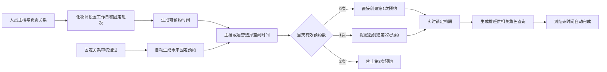

# 化妆部预约系统产品需求文档

> 文档版本：V1.2
> 编制日期：2026-07-27
> 文档状态：需求基线稿  
> 适用端：响应式手机网页、客服电脑网页、管理员电脑网页

---

## 1. 文档目的

本文档用于完整描述化妆部预约系统的业务目标、角色权限、预约规则、固定关系、班次与请假、排班查看与输出、数据结构及验收标准，作为后续原型设计、技术方案、开发、测试和上线验收的统一依据。

本系统用于替代目前依赖多张 Excel、自由文本、颜色、合并单元格、客服人工修改及拍照通知的排班流程，从预约源头生成结构化、无冲突、可追溯的化妆排班。

### 1.1 终端形态变更

自 2026-07-27 起，五类角色统一使用响应式网页，不再建设和发布微信小程序：

- 主播、运营和化妆师使用针对手机触控优化的网页。
- 客服和管理员使用针对电脑表格与高密度操作优化的网页。
- 五类角色共用同一个域名、认证体系和 React 应用，根据当前角色加载对应导航与页面。
- 既有小程序页面是迁移输入，不是最终发布渠道；迁移验收后删除 Taro、小程序构建和微信登录。
- 本节替代本文后续仍出现的“微信小程序”“小程序端”和“微信绑定”等旧渠道描述；业务规则本身保持不变。

---

## 2. 项目背景

### 2.1 当前业务规模

- 化妆师当前 50 多人，后续可能达到 100 人以上。
- 主播目前每日约 500 人，后续按每日 1,500 人预留。
- 工会主播总量接近 8,000 人。
- 月活跃主播 1,000 人以上，线下主播约 700～800 人。
- 运营当前 100 多人，后续可能达到 200 人以上。
- 当前有松江、现厂两个场地，即将增加无锡场地，未来需支持继续新增场地。
- 系统需支持数百人同时查看和提交预约。

### 2.2 当前流程

1. 固定主播由客服长期记录在化妆师的固定时间段内。
2. 单次主播每天人工沟通预约。
3. 固定主播临时请假、取消或改时间时，由客服直接修改 Excel。
4. 每天需要同时维护不同场地的两类排班表。
5. 客服排完第二天的班后，拍照发送给化妆师。
6. 排班数据还需要通过 `排班表清洗.py` 和人工规则清洗成：

   `化妆师 | 时间 | 主播编号 | 主播姓名`

7. 主播编号依赖 `化妆登记表.xlsx` 按真实姓名反向匹配。

### 2.3 当前痛点

- 日期、固定、休息、改期、取消、替换主播等信息挤在同一个单元格内。
- 不同场地的排班表结构不一致。
- 依赖颜色、合并单元格、别名、错别字和人工经验表达业务含义。
- 主播姓名和编号均为人工录入，重名主播容易匹配错误。
- 同一化妆师可能被重复安排或出现时间区间重叠。
- 临时加单、改期、取消和请假频繁，修改容易遗漏。
- 排班修改历史难以追踪。
- 客服每天需要重复整理、清洗、核对和发送排班。
- 业务规模增长后，Excel 无法可靠支撑多人并发操作。

---

## 3. 产品目标

### 3.1 核心目标

1. 主播和运营可以通过手机完成预约。
2. 正常预约不经过客服审核，满足规则后自动确认。
3. 系统实时计算化妆师空闲时间并防止时间重叠。
4. 主播编号和姓名来自人员主档，不允许自由录入。
5. 固定关系自动生成固定预约，单日例外不破坏长期规则。
6. 自动生成今日、明日、未来七日和历史排班。
7. 自动生成与现有整理表一致的 Excel 排班文件。
8. 所有预约、取消、改期、请假和审批均可追溯。
9. 主播、化妆师和运营在手机网页内查看授权范围内的最新排班。
10. 支持多场地、数百并发和每日 1,500 条以上预约。

### 3.2 成功标准

- 同一化妆师重叠预约数量为 0。
- 同一主播超过每日两次有效预约的数量为 0。
- 系统生成排班中的主播编号与人员主档一致率为 100%。
- 正常排班不再需要人工清洗。
- 客服可以直接导出规定格式的每日排班表。
- 预约、改期和取消均能查询操作人及修改前后内容。
- 各角色在网页内能够清晰区分有预约、无预约、非工作日和未配置班次。

### 3.3 非目标

第一期不包含：

- 系统自动决定主播应分配给哪位化妆师。
- 化妆师绩效、奖金或费用结算。
- 主播直播间资源排班。
- 主播未到场考勤及“未到场”状态。
- 固定关系暂停和恢复。
- 原生手机 App 和微信小程序；第一期统一采用响应式网页。

---

## 4. 核心原则

1. **人员主档唯一**：主播以唯一主播编号识别，重名不影响系统判断。
2. **时间区间排他**：冲突判断使用完整开始和结束时间，不只比较开始时间。
3. **先到先得**：多人抢同一化妆师重叠档期时，以数据库成功锁定顺序为准。
4. **零点锁定**：预约日期当天 00:00 后，任何角色均不能新增、改期或取消当天预约。
5. **历史不可覆盖**：改期通过取消原预约、新建预约实现，保留完整历史。
6. **固定关系与每日预约分离**：固定关系负责生成每日预约，每日预约保存实际执行结果。
7. **实际排班为准**：排班始终展示实际预约化妆师。
8. **场地隔离**：客服只能管理所属场地，管理员可以管理全部场地。
9. **无班次不开放**：化妆师未设置工作班次时不能被预约。
10. **正常预约无审批**：第一次和第二次预约均可直接确认，第二次必须显著提醒；每天最多两次。

---

## 5. 名词定义

| 名词 | 定义 |
|---|---|
| 主播主档 | 保存唯一主播编号、真实姓名、当前运营、场地和资格状态的人员资料 |
| 固定关系 | 主播与化妆师在指定星期和时间长期绑定的规则 |
| 固定预约 | 由固定关系自动生成，且化妆师和时间未被单日修改的预约 |
| 单次预约 | 人工新建，或固定预约单日改时间、换化妆师后生成的预约 |
| 实际预约化妆师 | 当天实际为主播提供服务并显示在排班中的化妆师 |
| 工作班次 | 化妆师所有常规工作日共用的上班、午休和下班时间模板 |
| 非工作日 | 化妆师每周未选择为工作日的星期，默认不生成任何排班 |
| 加班日 | 将某个非工作日临时开放为可排班日期 |
| 有效预约 | 状态为“已预约”的预约；已取消不计入每日次数 |
| 预约序号 | 主播当天第 1 次或第 2 次有效预约，不属于预约状态 |
| 当前运营 | 主播在预约日期对应的运营；未分配运营时允许为空 |

---

## 6. 角色与权限

### 6.1 主播

- 只能给自己预约。
- 查看本人今日、明日、未来七日及历史预约。
- 选择化妆师、开始时间和预约时长。
- 在截止时间前取消或改期本人预约。
- 有有效固定关系时可以提交主播请假。
- 不能申请、修改或取消长期固定关系。
- 不能查看其他主播资料和排班。

### 6.2 运营

- 只能为当前由自己负责的主播预约、改期和取消。
- 查看自己负责主播的排班和预约历史。
- 为负责主播申请固定关系。
- 申请修改固定星期或固定时间。
- 申请取消固定关系。
- 在小程序内查看所有负责主播的当日排班，包括无预约主播。

### 6.3 化妆师

- 首次登录必须设置自己的固定班次和每周工作日。
- 未完成设置时不能被预约，并持续收到系统提醒。
- 查看个人今日、明日、未来七日和历史排班。
- 提交化妆师请假。
- 提交非工作日加班申请。
- 提交后续班次或工作日修改申请。
- 在小程序内查看自己的当日排班和空排班状态。

### 6.4 客服

- 仅管理所属场地。
- 查看本场地所有主播、化妆师和排班。
- 为本场地主播创建单次预约，并在截止时间前进行改期或取消；所有次数、班次、请假和冲突规则与主播自助预约一致。
- 审核固定申请、固定规则修改和取消固定申请。
- 审核化妆师后续班次修改。
- 审核化妆师加班申请。
- 代化妆师完成首次班次设置。
- 直接维护本场地人员资料和班次，但必须记录日志。
- 查看本场地预约和修改历史。
- 导出本场地排班表。
- 不能突破预约日当天 00:00 锁定规则修改当天预约。

### 6.5 管理员

- 管理所有场地和全部人员。
- 配置角色、权限和公开预约规则。
- 为任意场地主播创建单次预约，并在截止时间前进行改期或取消。
- 维护人员主档和人员关系。
- 代化妆师设置或修改班次。
- 查看全部审批和操作日志。
- 导出分场地或合并排班。
- 不能突破预约日当天 00:00 锁定规则修改当天预约。

---

## 7. 人员与场地主档

### 7.1 主播主档

主播编号是业务唯一标识，真实姓名允许重名。

建议字段：

| 字段 | 必填 | 说明 |
|---|---:|---|
| 主播内部 ID | 是 | 系统自动生成 |
| 主播编号 | 是 | 业务唯一，不允许重复 |
| 真实姓名 | 是 | 允许重名 |
| 主播昵称 | 否 | 展示和搜索使用 |
| 当前场地 | 是 | 用于默认筛选和权限 |
| 当前运营 ID | 否 | 尚未分配运营时允许为空 |
| 预约资格状态 | 是 | 正常、暂停资格、取消资格 |
| 状态生效时间 | 是 | 用于历史追踪 |

暂停资格或取消资格的主播不能新增预约。

### 7.2 主播与运营关系

- 未分配运营的主播可以先录入主播名单，运营关系允许为空。
- 未分配运营时，主播仍可以为本人预约，但不能由运营代预约或发起固定申请。
- 主播与运营关系必须保存生效日期和结束日期。
- 结束日期默认空，表示没有结束期限。
- 首批对应表没有开始日期时，以首次正式导入确认日期作为生效日期；上线后的新增或换运营必须明确生效日期。
- 系统按预约日期判断对应运营。
- 主播分配运营后建立运营关系，换运营时结束旧关系并建立新关系。
- 历史预约保存当时运营快照，后续换运营不修改历史。

### 7.3 化妆师主档

化妆师当前没有业务编号，系统必须生成不可变的内部 ID；昵称仅用于展示。

建议字段：

- 化妆师内部 ID
- 昵称
- 真实姓名（可选）
- 所属场地
- 账号绑定信息
- 是否在职
- 班次是否配置完成
- 当前班次版本
- 创建时间、修改时间

### 7.4 运营、客服主档

均需保存内部 ID、姓名、账号、所属场地、在职状态和权限角色。

### 7.5 场地主档

首期场地包括：

- 松江
- 现厂
- 无锡

场地支持后台新增、停用和修改名称。

预约场地以实际预约化妆师的所属场地为准。主播也保存当前场地，用于默认筛选；主播场地变化时由人员表同步更新。

---

## 8. 化妆师班次与可预约时间

### 8.1 首次设置

化妆师第一次登录时必须设置：

- 每周工作日，可选择周一至周日任意组合。
- 最早上班时间。
- 午休开始时间。
- 午休结束时间。
- 最晚下班时间。
- 是否无午休。

时间均以 15 分钟为最小粒度。

化妆师所有常规工作日使用同一套固定班次，不支持不同星期配置不同班次。

化妆师也可以选择周一至周日全部为工作日，需要休息时再请假。

### 8.2 未配置状态

未完成首次设置时：

- 不出现在可预约化妆师列表中。
- 不能申请固定关系。
- 不能接受固定或单次预约。
- 每次登录显示强提醒。
- 个人页面持续显示未完成标识。
- 客服和管理员后台展示未配置名单。

提醒文案：

> 你尚未设置工作时间，目前主播无法预约你。请先完成可预约时间设置。

### 8.3 固定班次校验

必须满足：

- 上班时间早于午休开始时间。
- 午休开始时间早于午休结束时间。
- 午休结束时间早于下班时间。
- 如果选择无午休，则上班至下班为连续区间。
- 所有时间必须落在 15 分钟刻度上。

### 8.4 可预约时间计算

化妆师某日可预约时间等于：

`常规工作日或已批准加班日 + 当日班次 - 午休 - 请假 - 固定预约 - 单次预约`

预约完整区间必须处于工作区间内。例如午休 12:00 开始：

- 11:30 开始、30 分钟：可预约。
- 11:30 开始、45 分钟：不可预约。
- 11:45 开始、15 分钟：可预约。
- 11:45 开始、30 分钟：不可预约。

### 8.5 非工作日

化妆师非工作日默认：

- 不生成固定预约。
- 不能建立单次预约。
- 不展示可预约时间。
- 不生成该化妆师的当日排班。
- 不产生“已取消”记录，因为原本不存在预约。

“每天固定”是指每个有效工作日生成，不是自然日每天生成。

### 8.6 加班

化妆师可为某个非工作日提交加班申请，填写：

- 加班日期
- 开始时间
- 午休时间或无午休
- 结束时间
- 加班原因

默认权限规则：

- 化妆师提交后，由所属场地客服审核。
- 客服可直接为本场地化妆师添加加班。
- 管理员可直接为任意场地化妆师添加加班。

加班批准后：

- 指定日期临时开放预约。
- 可以生成符合条件的固定预约。
- 可以建立单次预约。
- 不改变每周固定工作日模板。

### 8.7 后续修改班次

- 化妆师首次设置后，修改工作日、上班、午休或下班时间需要所属场地客服审核。
- 审核期间原班次继续生效。
- 修改最早从次日生效，不影响当天锁定排班。
- 客服和管理员代为修改时可直接生效，但必须记录日志。
- 修改缩短可用时间时，审批页面必须列出未来受影响预约。
- 审批通过后，受影响预约变为已取消并释放档期；固定关系本身不取消。
- 修改延长时间时，新增时间段在生效后开放预约。

### 8.8 临时不可排班时段

当化妆师只有某一天的局部时间因上课、开会等原因不能接妆时，使用“临时不可排班时段”，不修改长期固定班次，也不要求整日请假。

- 时间使用 15 分钟粒度，单日可以添加多个互不重叠的时段。
- 化妆师本人可设置明日起未来七日；所属场地客服可设置今天起未来七日；管理员可为任意场地设置今天起未来七日。
- 时段必须完整落在当日有效常规班次或已批准加班时间内，不能落在午休、请假或已有临时不可排班时段中。
- 提交前必须展示重叠预约数并二次确认；确认后立即生效，无需审批。
- 生效时只取消与该时段重叠的固定和单次预约，固定关系继续有效，其他时间预约不受影响。
- 撤销临时不可排班时段后重新开放档期，但不自动恢复此前已取消的预约。
- 固定申请把该时段视为临时日期冲突，并给出最后冲突日期之后的最早可长期固定日期。
- 排班表必须同时展示扣减后的可排时间和原临时不可排班时段。
- 创建、取消和受影响预约均记录操作人、角色、原因、时间、场地和修改前后状态。

---

## 9. 普通预约规则

### 9.1 可预约日期

- 当天排班只可查看，不能新增、改期或取消。
- 预约人可预约从明天起未来七日。
- 示例：7 月 20 日可预约 7 月 21 日至 7 月 27 日。
- 今日、明日和未来七日均提供独立快捷入口。

### 9.2 时间粒度与时长

- 开始时间以 15 分钟为最小粒度。
- 可选时长：15、30、45、60 分钟。
- 默认时长：30 分钟。
- 预计需要 40 分钟的妆容必须选择 45 分钟。
- 单条预约不能超过 60 分钟。

预约页面提示：

> 普通妆容默认 30 分钟；预计需要 40 分钟的妆容请选择 45 分钟，避免影响后续排班。

### 9.3 预约人范围

- 主播只能预约本人。
- 运营只能预约当前负责主播。
- 客服可以为所属场地主播创建单次预约。
- 管理员可以为任意场地主播创建单次预约。
- 无论由谁创建，正常第一次和第二次预约均不需要审批，并遵守相同的每日次数、班次、请假、场地和冲突规则。

### 9.4 每日预约次数

- 每名主播每天最多两条有效预约。
- 第一次预约校验通过后直接成功。
- 第二次预约不审核，但提交前必须明确提示。
- 第三次预约系统直接禁止。
- 固定预约计入每日次数。
- 已取消预约不计入有效次数。
- 改期产生的替代预约继承原预约序号。

第二次预约确认提示至少包含：

- 当前已有预约的化妆师、时间和场地。
- 新预约的化妆师、时间和场地。
- “这是当天第 2 次化妆预约”的醒目标识。
- 每天最多两次的规则说明。

### 9.5 冲突判断

以下情况不能预约：

- 化妆师未完成班次配置。
- 日期不是化妆师工作日，且无已批准加班。
- 预约完整区间超出上班或加班时间。
- 预约区间与午休重叠。
- 化妆师处于请假状态。
- 主播处于请假状态。
- 主播资格被暂停或取消。
- 同一化妆师已有重叠预约。
- 同一主播已有重叠预约。
- 主播当天已有两条有效预约。

时间区间采用左闭右开方式判断，例如 07:00—07:30 与 07:30—08:00 不冲突。

### 9.6 先到先得

- 打开页面或选择时间不占用档期。
- 最终提交时，系统重新校验并使用数据库事务锁定档期。
- 第一个成功写入的人预约成功。
- 后续提交者提示档期刚刚被占用并刷新可用时间。
- 第二次预约也只在最终确认提交成功后占用档期。

### 9.7 零点锁定

预约日期当天 00:00 后：

- 不能新增当天预约。
- 不能取消当天预约。
- 不能修改当天时间、时长或化妆师。
- 客服和管理员同样不能修改。
- 已锁定排班只允许查看和导出。

---

## 10. 固定关系与固定申请

### 10.1 操作权限

所有长期固定关系相关操作只能由当前负责主播的运营发起。尚未分配运营的主播不能申请固定关系：

| 操作 | 发起人 | 审核人 |
|---|---|---|
| 新建固定关系 | 当前运营 | 所属场地客服 |
| 修改固定星期 | 当前运营 | 所属场地客服 |
| 修改固定时间 | 当前运营 | 所属场地客服 |
| 取消固定关系 | 当前运营 | 所属场地客服 |

主播本人不能操作长期固定关系。

### 10.2 固定关系字段

- 主播
- 固定化妆师
- 固定场地
- 固定方式：每天或指定星期
- 选中的星期
- 固定开始时间
- 固定时长
- 固定开始日期
- 固定结束日期，默认空
- 当前状态
- 创建申请人
- 审核人和审核时间

固定关系默认长期有效，只有取消固定审核通过后才写入结束日期。

不设置暂停固定和恢复固定。

### 10.3 固定预约生成

- 系统持续生成未来至少七日的固定预约占位。
- “每天固定”仅在化妆师工作日或批准的加班日生成。
- “指定星期固定”仅在选中星期且属于化妆师工作日时生成。
- 化妆师非工作日不生成预约，也不生成取消记录。
- 化妆师请假时取消受影响预约，但不取消固定关系。
- 固定预约保持原化妆师、原时间时，预约类型显示为“固定预约”。

### 10.4 固定可用时间判定

固定申请需要判断多日连续可用性，不能只看申请当天。

#### 固定冲突

如果所选化妆师、星期和时间区间与以下规则重叠，则该时间不能选择：

- 已生效固定关系。
- 待审核固定申请。
- 待审核固定星期或时间修改申请。

待审核固定申请暂时占用长期档期，驳回或撤回后释放。

#### 单次冲突

如果没有固定冲突，但未来已经存在单次预约：

- 所选时间仍可申请固定。
- 固定开始日期必须晚于最后一条冲突单次预约日期。
- 系统推荐“最早可一直固定的日期”。
- 只检查固定规则选中星期对应的日期。

例如希望每天固定 07:00，未来 7 月 26 日和 7 月 29 日存在冲突单次预约，则最早连续固定日期为 7 月 30 日。

固定申请页面显示：

| 时间状态 | 含义 | 操作 |
|---|---|---|
| 红色 | 已被固定规则长期占用 | 不可选择 |
| 橙色 | 未来存在单次预约 | 可选择，必须使用推荐开始日期之后的日期 |
| 绿色 | 无固定或单次冲突 | 可按期望日期开始 |

### 10.5 固定申请提交与审核

1. 当前运营选择主播、化妆师、星期、时间、时长和期望开始日期。
2. 系统展示可固定时间和最早连续开始日期。
3. 提交时再次实时校验并锁定长期档期。
4. 申请进入待审核。
5. 原有单次预约保持不变。
6. 客服审核通过后建立正式固定关系并生成固定预约。
7. 驳回后释放长期档期。

固定开始日期允许超过普通预约的七日范围，以支持避开未来七日内已经存在的单次预约。

### 10.6 修改长期固定星期或时间

- 只能由当前运营申请。
- 必须填写新星期、新时间、生效日期和修改原因。
- 生效日期最早为次日。
- 审核期间原固定规则继续有效。
- 审核通过后，生效日期之后尚未执行的原固定预约转为已取消。
- 按新规则重新生成的预约仍属于固定预约。
- 已完成和历史预约不修改。
- 如果新固定时间发生长期冲突，客服不能通过。

### 10.7 取消固定关系

- 只能由当前运营申请。
- 需要所属场地客服审核。
- 审核通过后写入固定结束日期。
- 结束日期之后不再生成固定预约。
- 主播转为普通单次预约主播。
- 历史固定预约不改变。

---

## 11. 单日取消、改期与换化妆师

### 11.1 单日取消

- 固定主播可以只取消某一天的固定预约。
- 取消后原档期立即释放，可被其他主播预约。
- 固定关系不受影响，后续继续正常生成。
- 原预约状态变为“已取消”。

### 11.2 改时间

改时间不得覆盖原预约，必须按以下事务执行：

1. 校验并锁定新档期。
2. 创建新预约。
3. 将原预约变为已取消。
4. 建立原预约与替代预约关联。
5. 如果新档期锁定失败，原预约保持不变。

固定主播即使改到同一化妆师的不同时间，新预约也属于单次预约。

### 11.3 更换化妆师

- 固定主播临时改时间时，优先展示原固定化妆师的可用时间。
- 原固定化妆师无空档时，可以选择同场地其他化妆师。
- 更换后新预约属于单次预约。
- 排班展示实际预约化妆师。
- 原固定关系不改变。

### 11.4 预约类型判定

只有满足以下条件才显示为固定预约：

- 由有效固定关系自动生成。
- 实际预约化妆师等于固定化妆师。
- 实际开始时间等于固定时间。
- 未经过单日改期或换人。

其他预约均显示为单次预约。

---

## 12. 请假管理

### 12.1 通用规则

- 主播和化妆师请假均不需要人工审核。
- 单次请假最长七日。
- 只能申请未来七日范围内的请假。
- 到请假日期当天 00:00 后不能新增或取消当天请假。
- 请假提交前必须展示受影响预约并二次确认。

### 12.2 主播请假

- 主播请假主要面向存在有效固定关系的主播。
- 请假确认后，范围内所有预约全部取消，包括固定预约和单次预约。
- 释放所有相关化妆师档期。
- 固定关系继续有效。
- 请假结束后继续按固定规则生成。
- 主播、所有受影响化妆师以及当前运营（如有）可查询最新取消结果。

### 12.3 化妆师请假

- 请假确认后，范围内该化妆师的全部固定和单次预约转为已取消。
- 释放全部档期。
- 不取消化妆师与主播的固定关系。
- 所有受影响主播可在排班页面重新选择时间或化妆师。
- 对应运营（如有）可查看本人负责主播的最新排班。
- 请假结束后继续按原固定规则生成。

化妆师确认页需展示请假日期、受影响预约数、固定主播数和取消后果。

### 12.4 取消请假

- 只能在请假首日当天 00:00 前取消尚未开始的请假。
- 撤销化妆师请假时，系统恢复由该请假记录取消、且固定关系在目标日期仍然有效的原固定预约。
- 化妆师请假有效期间本人整天不可预约，不会因为固定预约被取消而对外开放请假日期。
- 取消主播请假不自动恢复预约；单次预约和由其他原因取消的预约也不恢复，需要重新预约。
- 主播或运营主动取消某天的固定预约实例后，该化妆师当天原时段立即可供其他主播预约。
- 主动取消固定预约实例只影响所选日期，长期固定关系和其他日期不受影响。

---

## 13. 预约状态与自动完成

### 13.1 预约类型

- 固定预约
- 单次预约

### 13.2 预约状态

系统只保留：

| 状态 | 说明 |
|---|---|
| 已预约 | 已成功占用化妆师档期 |
| 已取消 | 主动取消、请假取消、改期取消或规则变更取消 |
| 已完成 | 当前时间已经超过预约结束时间 |

不设置待二次预约审核和未到场状态。

### 13.3 自动完成

- 系统根据预约结束时间自动将“已预约”更新为“已完成”。
- 例如 07:00 开始、45 分钟预约，在 07:45 后变为已完成。
- 自动完成不修改预约类型和历史字段。

---

## 14. 排班查看

### 14.1 主播端

- 今日排班：只读。
- 明日排班。
- 未来七日排班及可预约时间。
- 历史预约。
- 展示类型、状态、化妆师、时间、时长、场地和每日序号。

### 14.2 化妆师端

- 今日个人排班。
- 明日个人排班。
- 未来七日个人排班。
- 历史排班。
- 按开始时间排序。

### 14.3 运营端

- 查看负责主播今日、明日、未来七日和历史排班。
- 同时展示有预约和无预约主播。
- 支持按主播编号、姓名、日期、化妆师和状态筛选。

### 14.4 客服和管理员端

- 按场地、日期、化妆师、主播、预约类型和状态筛选。
- 日历视图、化妆师时间轴视图和列表视图。
- 查看空闲时间、工作时间、午休、请假和非工作日。
- 查看固定申请、班次申请和加班申请。
- 查看修改日志和后台任务状态。

---

## 15. 小程序内信息查看

- 第一阶段不建设微信订阅消息、公众号消息、短信、站内消息中心、预约提醒或每日推送。
- 预约新增、取消、改期、换人、请假和审批结果以业务事务和审计记录为准，相关角色进入小程序后查询最新状态。
- 主播查看本人今日、明日和未来七日预约；运营查看负责主播；化妆师查看本人排班。
- 当天 00:00 锁定规则保持不变，但不在 00:01 生成或发送通知。
- 微信 AppID 与 AppSecret 仅用于登录，不得用于消息发送模块。
- 若以后重新引入外部通知，应作为独立版本重新立项、确认合规能力并重新设计数据模型，不预留无业务用途的通知代码。

---

## 16. 排班导出

### 16.1 标准导出格式

为兼容现有流程，Excel 默认输出四列：

| 化妆师 | 时间 | 主播编号 | 主播姓名 |
|---|---|---|---|

时间统一输出为 `HH:MM`。

### 16.2 导出范围

- 按日期导出。
- 按场地分别导出。
- 管理员可合并导出全部场地。
- 默认只导出状态为已预约或已完成的有效排班，不导出已取消记录。
- 同一化妆师按时间升序排列。

### 16.3 页面扩展字段

系统页面可以额外展示：

- 预约日期
- 场地
- 预约类型
- 开始时间
- 预约时长
- 结束时间
- 当天第几次预约
- 预约状态
- 实际预约化妆师
- 当前运营（如有）
- 预约发起人

---

## 17. 审批中心

第一期需要审核的申请包括：

- 新建固定关系。
- 修改固定星期。
- 修改固定时间。
- 取消固定关系。
- 化妆师后续修改固定班次或工作日。
- 化妆师加班申请。

普通第一次和第二次预约、主播请假、化妆师请假不审核。

审批记录状态建议为：

- 待审核
- 已通过
- 已驳回
- 已撤回

审批状态属于申请记录，不属于预约状态。

客服只能审批本场地申请。管理员可查看全部申请，并可在权限允许时处理。

---

## 18. 修改记录与审计

### 18.1 必须记录的操作

- 新增预约
- 取消预约
- 改时间
- 更换化妆师
- 修改预约时长
- 新建、修改和取消固定关系
- 主播请假
- 化妆师请假
- 首次班次设置
- 后续班次修改
- 加班申请和审批
- 人员资格、场地和运营关系变更

### 18.2 日志字段

- 操作记录 ID
- 操作对象类型和 ID
- 操作人 ID、姓名和角色
- 操作时间
- 操作类型
- 修改前内容
- 修改后内容
- 操作原因
- 来源设备或客户端
- 关联原预约 ID 和替代预约 ID

### 18.3 查看权限

- 管理员查看全部日志。
- 客服查看本场地日志。
- 主播、运营和化妆师查看与自身相关的预约变更记录，不查看后台全局日志。

日志不可由普通业务人员删除或修改。

---

## 19. 核心数据模型

### 19.1 用户与权限

- `user`：账号、姓名、手机号、微信身份、状态。
- `role`：主播、运营、化妆师、客服、管理员。
- `user_role`：用户与角色关系。
- `site`：场地主档。

### 19.2 人员业务数据

- `host_profile`：主播编号、姓名、昵称、场地、资格状态。
- `artist_profile`：化妆师内部 ID、昵称、场地、班次配置状态。
- `operator_profile`：运营资料和场地。
- `host_operator_relation`：主播与运营的生效区间关系，允许运营为空。

### 19.3 班次和日期例外

- `artist_shift_template`：工作日、上班、午休、下班、生效日期和版本。
- `artist_shift_change_request`：班次修改申请。
- `artist_overtime`：加班日期和加班时间。
- `leave_request`：主播或化妆师请假。

### 19.4 固定关系

- `fixed_rule`：固定主播、固定化妆师、星期、时间、时长、开始和结束日期。
- `fixed_request`：新建、修改或取消固定申请。
- `fixed_rule_version`：固定规则历史版本。

### 19.5 预约

预约至少包含：

- 预约 ID
- 主播 ID 和主播编号快照
- 主播姓名快照
- 实际预约化妆师 ID 和昵称快照
- 场地 ID 和名称快照
- 预约日期
- 开始时间
- 时长
- 结束时间
- 预约类型：固定或单次
- 状态：已预约、已取消、已完成
- 当天预约序号：1 或 2
- 固定关系 ID，可空
- 原预约 ID，可空
- 替代预约 ID，可空
- 发起人和发起角色
- 当前运营快照，可空
- 取消原因
- 创建、修改时间

### 19.6 审计

- `operation_log`：完整操作审计。

---

## 20. 页面清单

### 20.1 手机端公共页面

- 登录与账号绑定
- 首页
- 个人资料

### 20.2 主播端

- 我的今日排班
- 我的明日排班
- 未来七日预约
- 选择化妆师与时间
- 第二次预约确认
- 我的历史预约
- 改期确认
- 取消预约
- 主播请假

### 20.3 运营端

- 负责主播列表
- 主播排班汇总
- 代主播预约
- 固定申请
- 固定时间可用性页面
- 固定星期或时间修改申请
- 取消固定申请
- 申请记录

### 20.4 化妆师端

- 首次班次设置
- 班次信息
- 班次修改申请
- 今日、明日和未来七日个人排班
- 历史排班
- 化妆师请假
- 加班申请

### 20.5 客服电脑端

- 本场地排班总览
- 化妆师时间轴
- 今日、明日、未来七日和历史排班
- 固定申请审批
- 固定修改及取消审批
- 班次修改审批
- 加班审批
- 人员主档查询
- 化妆师未配置提醒名单
- 修改日志
- Excel 导出

### 20.6 管理员电脑端

- 全场地总览
- 场地管理
- 人员主档与批量导入
- 人员关系管理
- 角色与权限管理
- 预约规则配置
- 后台任务状态
- 全部审批和审计日志
- 数据导出与系统配置

---

## 21. 关键业务流程

### 21.1 普通预约

1. 预约人选择主播。
2. 系统校验操作人与主播的关系及主播资格。
3. 选择未来七日内日期。
4. 选择可用化妆师、开始时间和时长。
5. 系统检查当天有效预约次数。
6. 第二次预约时展示强提醒。
7. 提交时实时锁定档期。
8. 成功后生成已预约记录。
9. 返回预约结果，相关角色重新查询即可看到最新排班。

### 21.2 单日改期

1. 选择原预约。
2. 选择新化妆师、时间或时长。
3. 系统校验新档期。
4. 原子化创建新单次预约并取消原预约。
5. 返回改期结果，相关角色重新查询即可看到原记录和新预约。

### 21.3 固定申请

1. 当前运营选择主播和化妆师。
2. 选择每天或指定星期、时间和时长。
3. 系统展示固定冲突、未来单次冲突和最早连续开始日期。
4. 提交并锁定长期档期。
5. 本场地客服审核。
6. 通过后生成固定关系和未来预约；驳回后释放。

### 21.4 化妆师请假

1. 化妆师选择未来七日内最长七日的日期范围。
2. 系统列出所有受影响预约。
3. 化妆师二次确认。
4. 批量取消预约并释放档期。
5. 保留固定关系。
6. 返回取消结果，相关角色重新查询即可看到空出的档期。

---

## 22. 异常与边界场景

### 22.1 多人同时抢档期

必须使用数据库唯一约束或事务锁保证只有一个请求成功，不能只依赖前端按钮置灰。

### 22.2 提交时档期失效

如果用户选中时间后，化妆师提交请假、班次发生变化或档期被抢占，最终提交必须失败并重新展示可用时间。

### 22.3 改期失败

新档期未锁定成功时不能取消原预约。

### 22.4 主播重名

所有匹配、次数统计和权限判断均按主播内部 ID 与唯一主播编号处理，姓名只用于展示。

### 22.5 化妆师改昵称或换场地

新预约使用最新资料；历史预约保留当时昵称和场地快照。

### 22.6 运营变化

运营按目标日期有效关系查询主播排班；未分配运营时运营侧无权查看。历史记录保留创建时运营快照。

### 22.7 零点锁定一致性

排班在当天 00:00 锁定；00:00 后禁止再新增、改期或取消当天预约。锁定与查询不依赖通知或汇总任务。

---

## 23. 非功能需求

### 23.1 性能与容量

- 支持至少 10,000 名主播主档。
- 支持至少 200 名化妆师。
- 支持至少 300 名运营和客服。
- 支持每日 1,500 条以上预约。
- 支持数百人并发查询和抢占档期。
- 常规排班查询响应目标不超过 2 秒。
- 预约提交及冲突判断响应目标不超过 3 秒。
- 单日排班 Excel 生成目标不超过 10 秒。

### 23.2 一致性

- 预约创建、取消原预约和新建替代预约必须具备事务一致性。
- 防止重复提交，所有创建接口支持幂等。
- 同一化妆师重叠档期必须由数据库层最终兜底。
- 主播每日最多两次必须由服务端校验。

### 23.3 安全与权限

- 所有接口进行登录和角色校验。
- 运营只能访问有效运营关系内的主播。
- 客服严格按场地隔离。
- 敏感人员资料按最小权限展示。
- 关键操作日志不可篡改。

### 23.4 可用性与备份

- 数据库定期自动备份。
- 支持备份恢复验证。
- 固定生成、自动完成和导出任务支持失败重试与监控。

### 23.5 兼容性

- 客服和管理员支持主流桌面浏览器。
- 主播、运营和化妆师支持微信内手机页面或小程序。
- 页面适配常见手机分辨率。
- 系统时区统一使用 `Asia/Shanghai`。

### 23.6 架构与可维护性

- 系统必须采用清晰、稳定的模块化架构，业务模块边界明确，避免业务规则散落或重复实现。
- 代码必须精简、高效、易读、易测试、易维护，在满足当前需求的前提下避免无效功能和过度设计。
- 核心预约、固定关系、请假和权限规则应集中封装，并通过自动化测试保护。
- 没有明确的业务、性能或运维收益时，不引入新的框架、中间件、抽象层或微服务。
- 架构应支持场地、人员和预约量增长，但不得以未来可能需求为由提前增加不必要的复杂度。
- 代码评审和验收必须同时检查功能正确性、并发安全、性能、可读性和可维护性。

---

## 24. 数据迁移与上线

### 24.1 主数据迁移

上线前需要导入：

- 主播人员表和唯一主播编号。
- 主播场地和资格状态。
- 化妆师名单、昵称和所属场地。
- 运营、客服名单及所属场地。
- 能精确匹配的主播—运营关系；无法匹配的运营按未分配处理。

化妆师工作日和班次在系统中首次设置，不从当前名单导入。`化妆师固定主播名单.xlsx` 只保留为历史参考，不导入固定关系或预约数据。

`化妆登记表.xlsx` 属于历史登记流水，可用于辅助校验，但不能直接作为唯一人员主档。

### 24.2 数据清洗

- 按主播编号去重。
- 输出一名多编号、一个编号多姓名的异常清单供人工确认。
- 化妆师创建内部 ID 并整理别名。
- 主播—运营关系无法精确匹配时留空，后续可在后台重新分配。
- 现有固定主播名单不参与数据清洗和生产迁移。

### 24.3 并行运行

建议上线初期新系统与原 Excel 流程短期并行：

1. 新系统生成每日排班。
2. 与现有清洗结果逐日核对。
3. 核对无误后停止手工排班和清洗。
4. 保留旧表只读归档。

---

## 25. 第一阶段范围建议

### P0：必须上线

- 人员、角色、场地主档。
- 主播与运营负责关系。
- 化妆师首次班次设置和可预约时间。
- 普通预约、第二次提醒、每日最多两次。
- 冲突检查和先到先得。
- 固定申请、修改和取消审核。
- 固定预约自动生成。
- 主播和化妆师请假。
- 化妆师班次修改和加班。
- 今日、明日、未来七日和历史排班。
- 三类手机端角色在小程序内查看最新排班和业务结果。
- 操作日志。
- 标准 Excel 导出。

### P1：上线后优化

- 更丰富的排班统计和利用率分析。
- 更丰富的小程序待办汇总。
- 批量人员关系调整。
- 预约高峰预警。
- 更精细的排班看板和筛选收藏。

---

## 26. 核心验收标准

### 26.1 预约

- 主播只能预约本人。
- 运营只能预约运营关系有效的主播。
- 可选择 15、30、45、60 分钟，默认 30 分钟。
- 预约不允许跨午休或下班时间。
- 同一化妆师重叠预约只有一个成功。
- 第二次预约显示提醒并可直接成功。
- 第三次预约无法提交。
- 当天 00:00 后无法新增、改期或取消。

### 26.2 固定

- 只有主播当前运营能提交固定相关申请。
- 固定申请必须由所属场地客服审核。
- 已被长期固定占用的时间不可选择。
- 被未来单次占用时能计算最早连续开始日期。
- 单日改期后原固定预约已取消，新预约显示单次。
- 取消固定通过后停止生成未来固定预约。

### 26.3 班次与请假

- 化妆师未设置班次时不可被预约。
- 非工作日不生成排班。
- 加班批准后指定日期开放排班。
- 后续班次修改需要客服审核。
- 化妆师请假后全部受影响预约取消，相关角色重新查询即可看到变化。
- 固定主播请假后范围内固定和单次预约全部取消，固定关系保留。

### 26.4 排班与小程序查看

- 可以查询今日、明日、未来七日和历史排班。
- 排班显示实际预约化妆师和固定或单次类型。
- 化妆师、主播和运营进入小程序后可看到授权范围内最新排班和空排班状态。
- 小程序不出现订阅授权、消息中心、通知发送状态或提醒入口。
- Excel 可以正确导出四列标准格式。

### 26.5 数据与审计

- 重名主播按唯一编号正确区分。
- 改期保留原预约已取消记录和新预约关联。
- 客服只能查看和审批本场地数据。
- 管理员和客服可以查看授权范围内完整修改记录。

---

## 27. 待技术设计阶段确认

人员表字段、导入方式、数据库结构和固定生成窗口已经在《现有数据盘点与导入规范》和《数据字典与数据库设计》中明确。以下事项仍需在原型或生产迁移前确认：

1. 加班申请是否设置自动失效时间；当前默认由所属场地客服审核。
2. 排班 Excel 默认生成分场地文件还是合并文件；系统能力仍同时支持两种方式。

---

## 28. 最终业务流程概览

---

## 29. 文档结论

本系统的核心不是自动替客服分配化妆师，而是把人员、场地、班次、固定关系、可用时间、预约次数和时间冲突全部结构化。预约人从系统计算出的真实空闲时间中选择，系统通过事务锁保证先到先得，并自动形成可以直接使用和导出的排班。

系统上线后，原有排班表中的日期、固定、休息、请假、改时间、替换主播和编号匹配不再依赖自由文本及清洗脚本；清洗脚本仅作为历史迁移和新旧系统核对工具保留。
