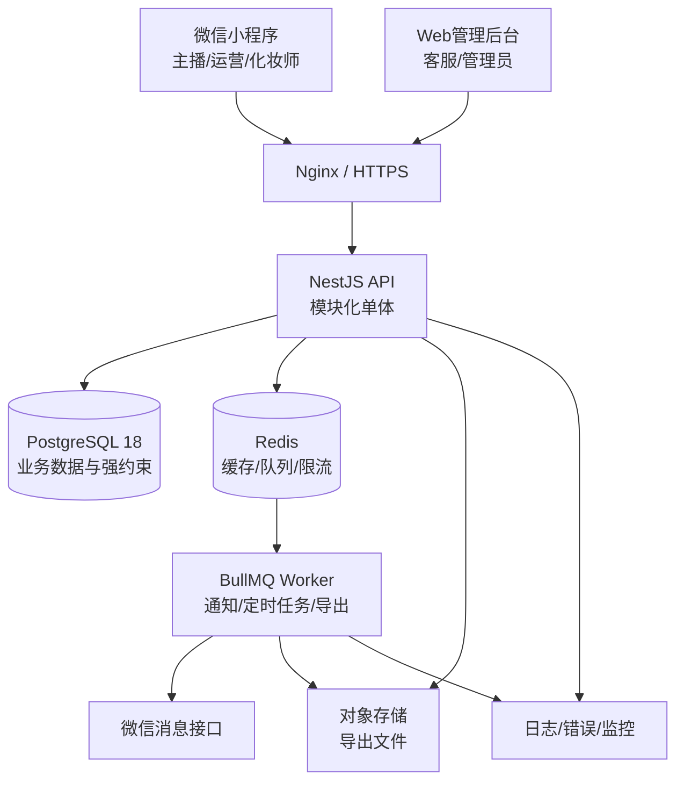

# 化妆部预约系统技术架构与工具选型

> 文档版本：V1.0  
> 编制日期：2026-07-20  
> 对应需求文档：`产品需求文档.md` V1.1

---

## 1. 文档目的

本文档确定化妆部预约系统第一期的技术架构、开发工具、代码组织、数据一致性方案、通知方案、部署方式、测试策略和 Git 使用规范，作为项目初始化和开发实施依据。

系统预计支持：

- 100～200 名化妆师。
- 10,000 名以上主播主档。
- 每日 1,500 条以上预约。
- 数百人同时查看或预约。
- 松江、现厂、无锡及后续新增场地。
- 微信小程序手机端和客服、管理员电脑端。

---

## 2. 架构决策摘要

第一期采用：

> TypeScript 全栈、微信小程序＋Web 管理后台、NestJS 模块化单体、PostgreSQL 强一致数据库、Redis 任务队列、Docker 部署。

关键决策：

1. 第一阶段使用模块化单体，不拆微服务。
2. PostgreSQL 是预约数据的唯一事实来源。
3. Redis 不作为预约是否冲突的最终判断依据。
4. 数据库排斥约束和事务负责防止化妆师时间重叠。
5. 手机端以微信小程序为主，客服和管理员使用响应式 Web 后台。
6. 前后端统一使用 TypeScript，减少模型重复和技术栈数量。
7. 人员 Excel 只用于首次导入和特殊批量导入，上线后在系统后台维护。
8. 所有代码和文档使用 Git 版本管理，每个完整逻辑变更测试后提交一次。
9. 架构和代码以精简、高效、易维护为硬性要求，不因预计规模提前引入微服务或无明确收益的基础设施。

### 2.1 工程与架构原则

- **保持简单**：优先使用最少的组件和最短的调用链完成需求，拒绝无业务价值的功能、依赖和抽象。
- **边界清晰**：按业务领域划分模块，接口层、应用层、领域规则和基础设施职责明确，禁止随意跨层访问。
- **规则集中**：预约冲突、次数限制、固定关系、请假和权限等核心规则必须有唯一实现位置，避免前后端或多个模块各自维护一套规则。
- **高效可靠**：数据库查询、事务和异步任务按实际容量设计；先保证正确性和可观测性，再针对可度量的瓶颈优化。
- **易于维护**：命名准确、函数短小、依赖方向单一；复杂逻辑必须有说明和测试，公共抽象只在语义稳定且确有复用时建立。
- **渐进演进**：第一期保持模块化单体；只有现有架构出现可验证的扩展、性能或团队协作瓶颈时，才拆分独立服务。
- **变更可控**：每次改动范围聚焦，测试覆盖对应风险，并通过 Git 保留清晰、可回退的版本历史。

---

## 3. 总体架构



第一期可以将 API 和 Worker 部署为同一代码库的两个进程，共享数据库和 Redis；后续通知量增长时再独立扩容 Worker。

---

## 4. 主推荐技术栈

| 层级 | 技术 | 用途 |
|---|---|---|
| 语言 | TypeScript | 前端、后端和共享类型 |
| 运行时 | Node.js 24 LTS | 后端、构建和任务进程 |
| 包管理 | pnpm workspace | Monorepo 依赖和脚本管理 |
| 手机端 | Taro＋React | 微信小程序，保留 H5 扩展能力 |
| 管理后台 | React＋Vite＋Ant Design | 客服和管理员电脑端 |
| 前端请求 | TanStack Query | 服务端数据查询、缓存和刷新 |
| 前端状态 | Zustand | 登录态和少量本地交互状态 |
| 后端框架 | NestJS＋Fastify | API、权限、业务模块和任务调度 |
| 接口协议 | REST＋OpenAPI | 前后端接口和自动文档 |
| 主数据库 | PostgreSQL 18 | 人员、预约、固定、班次、审批和日志 |
| ORM | Prisma | 类型安全查询、迁移和常规事务 |
| 原生 SQL | PostgreSQL Migration | 时间排斥约束、复杂索引和数据库函数 |
| 缓存和队列 | Redis＋BullMQ | 定时通知、延迟任务、失败重试和限流 |
| Excel | ExcelJS | 人员导入、排班导出 |
| 文件存储 | 腾讯云 COS 或阿里云 OSS | 临时导出文件和附件 |
| 网关 | Nginx | HTTPS、反向代理和静态文件 |
| 部署 | Docker Compose | 开发、测试和第一期生产部署 |
| 错误监控 | Sentry | 前后端异常和性能追踪 |
| 指标监控 | Prometheus＋Grafana | API、队列、数据库和任务监控 |

版本原则：初始化项目时锁定当时最新稳定小版本，运行时只使用 LTS 版本，不直接使用 Current 或测试版本。

官方参考：

- Node.js 版本状态：https://nodejs.org/en/about/previous-releases
- NestJS：https://docs.nestjs.com/
- React：https://react.dev/
- Vite：https://vite.dev/guide/
- Taro：https://docs.taro.zone/docs/
- PostgreSQL：https://www.postgresql.org/docs/18/
- Prisma：https://www.prisma.io/docs/orm
- BullMQ：https://docs.bullmq.io/
- 微信小程序：https://developers.weixin.qq.com/miniprogram/dev/framework/

---

## 5. 为什么采用模块化单体

当前业务规则复杂，但流量规模不需要微服务。模块化单体可以：

- 在一个事务中完成预约锁定、次数校验和历史记录。
- 减少服务间调用、分布式事务和部署复杂度。
- 保持模块边界，后续需要时可以拆分通知或报表服务。
- 让一个小型开发团队更容易维护和排查问题。

第一期不使用：

- Kubernetes
- Kafka
- Elasticsearch
- 服务网格
- 多语言后端
- 多数据库分片

---

## 6. 项目目录建议

```text
化妆部预约系统/
├─ README.md                # 项目入口和文档导航
├─ AGENTS.md                # 开发与Git协作规范
├─ apps/
│  ├─ miniapp/              # Taro微信小程序
│  ├─ admin-web/            # React管理后台
│  ├─ api/                  # NestJS API
│  └─ worker/               # BullMQ任务进程
├─ packages/
│  ├─ shared-types/         # 共享类型和枚举
│  ├─ api-client/           # OpenAPI生成的客户端
│  ├─ validation/           # 共享校验规则
│  └─ config/               # ESLint、TypeScript等公共配置
├─ prisma/
│  ├─ schema.prisma
│  ├─ migrations/
│  └─ seed/
├─ docs/
│  ├─ 产品需求文档.md
│  ├─ 技术架构与工具选型.md
│  ├─ 现有数据盘点与导入规范.md
│  ├─ 数据字典与数据库设计.md
│  ├─ 业务规则与状态流转.md
│  ├─ 角色权限矩阵.md
│  ├─ 页面与交互规格.md
│  ├─ 测试与验收方案.md
│  ├─ 项目实施计划.md
│  └─ 接口文档.md
├─ data/
│  ├─ README.md
│  └─ source/               # 本地敏感Excel，Git忽略
├─ scripts/                 # 数据导入、校验和运维脚本
├─ tests/                   # 跨应用集成与压测
├─ .env.example
├─ .gitignore
├─ docker-compose.yml
├─ package.json
└─ pnpm-workspace.yaml
```

当前正式文档已经整理到 `docs/`，五张人员 Excel 已经移动到受保护且被 Git 忽略的 `data/source/`。代码目录只在正式初始化工程时创建，人员名单不得提交到公共代码仓库。

---

## 7. 后端业务模块

| 模块 | 职责 |
|---|---|
| `auth` | 微信登录、后台登录、Token和会话 |
| `users` | 账号、角色和状态 |
| `sites` | 场地主档和场地权限 |
| `hosts` | 主播编号、姓名、场地和预约资格 |
| `artists` | 化妆师资料、昵称和场地 |
| `operators` | 运营资料和场地 |
| `host-operator` | 主播与运营的生效区间关系，可为空 |
| `shifts` | 化妆师固定工作日和班次版本 |
| `overtime` | 非工作日加班和审批 |
| `leave` | 主播和化妆师请假及影响处理 |
| `fixed-rules` | 固定申请、修改、取消和预约生成 |
| `appointments` | 预约、取消、改期、类型和状态 |
| `schedules` | 今日、明日、未来七日和历史排班 |
| `approvals` | 固定、班次和加班审批 |
| `notifications` | 微信通知、20:00汇总和一小时前提醒 |
| `imports` | 人员Excel导入、校验和差异报告 |
| `exports` | 标准排班Excel生成 |
| `audit` | 操作日志和修改前后快照 |

模块之间只能通过公开服务接口交互，禁止跨模块随意访问内部表和实现。

---

## 8. 数据库与并发预约设计

### 8.1 PostgreSQL作为最终约束

前端可用时间只是展示结果，不能作为最终保证。提交预约时必须由服务端和数据库重新校验。

预约时间保存：

- `start_at`：开始时间
- `end_at`：结束时间
- `time_range`：数据库生成的时间范围

对状态为“已预约”的记录建立化妆师时间排斥约束，示意：

```sql
EXCLUDE USING gist (
  artist_id WITH =,
  tstzrange(start_at, end_at, '[)') WITH &&
)
WHERE (status = 'BOOKED');
```

这样即使多个 API 进程同时写入，同一化妆师重叠档期也只有一个能成功。

### 8.2 主播每日最多两次

预约表保存 `daily_sequence`，取值 1 或 2。

数据库和服务端共同保证：

- 同一主播、同一预约日期、同一序号只能有一条已预约记录。
- 已取消记录不占用序号。
- 改期新预约继承原序号。
- 第三次预约直接拒绝。

### 8.3 预约提交事务

一次预约提交在短事务内完成：

1. 校验用户权限和主播资格。
2. 校验预约日期、班次、午休、请假和场地。
3. 计算主播当天有效预约次数。
4. 写入预约并触发数据库排斥约束。
5. 写入操作日志。
6. 写入待发送通知任务。
7. 提交事务。

事务内不得调用微信或对象存储等外部网络服务。

### 8.4 改期事务

1. 尝试写入新的单次预约。
2. 新预约成功后将原预约改为已取消。
3. 建立 `original_appointment_id` 和 `replacement_appointment_id`。
4. 写入两条预约的操作日志和通知任务。
5. 任一步失败则全部回滚，原预约继续有效。

### 8.5 幂等

预约、取消、请假和审批接口均需要 `Idempotency-Key`。重复点击或网络重试不能创建重复记录。

---

## 9. 固定排班计算

固定关系不直接替代预约表。系统维护固定规则，并按滚动窗口生成具体预约实例。

建议：

- 始终保证未来至少八日固定预约已生成。
- 每日固定任务补齐新的第八日。
- 固定审核通过或规则变化后立即重新计算受影响日期。
- 非工作日不生成；加班批准后重新计算该日期。
- 请假取消具体预约但不删除固定规则。

固定申请可用性计算分两步：

1. 检查长期固定规则冲突；冲突时间不可选。
2. 检查未来单次预约；推荐最后一个冲突日期之后的最早连续开始日期。

待审核固定申请需要创建长期档期占用，防止两个运营同时申请同一长期时间。

---

## 10. Redis与任务队列

Redis用于：

- BullMQ任务队列。
- API限流计数。
- 短时查询缓存。
- 登录会话或Token辅助状态。
- 认证接口跨实例限流计数；键名只保存客户端标识的 SHA-256 摘要，Redis 不可用时认证入口默认拒绝。

Redis不用于保存预约主数据，也不作为防止预约冲突的唯一锁。

建议队列：

| 队列 | 任务 |
|---|---|
| `notification-immediate` | 新增、取消、改期和请假实时通知 |
| `schedule-daily` | 每天20:00次日排班汇总 |
| `appointment-reminder` | 主播预约前一小时提醒 |
| `fixed-generation` | 未来固定预约补齐和重算 |
| `appointment-completion` | 到结束时间自动完成 |
| `excel-export` | 大批量排班和数据导出 |
| `data-quality` | 人员关系和异常数据检查 |

每个任务需要：

- 可重复执行而不产生重复消息。
- 明确最大重试次数和退避策略。
- 记录业务对象ID和任务追踪ID。
- 失败后进入人工可见的失败列表。

---

## 11. 微信小程序与通知

### 11.1 登录

手机端使用微信授权登录，并绑定系统人员记录：

- 主播绑定唯一主播编号。
- 化妆师绑定内部化妆师ID。
- 运营绑定内部运营ID。

首次绑定统一使用管理员或本场地客服发放的一次性绑定码，不开发手机号验证分支，也不能只凭姓名绑定。绑定码只展示一次、24 小时有效、最多尝试 5 次，服务端只保存带密钥摘要。

小程序通过 `wx.login` 取得临时代码，服务端使用微信 `auth.code2Session` 换取并保存 OpenID；`session_key` 不返回客户端、不进入业务日志。未绑定身份只获得 10 分钟有效的高熵绑定凭证，完成绑定后才可创建正式会话。

正式会话使用 15 分钟 HS256 访问令牌与 30 天高熵刷新令牌。访问令牌只携带用户、会话和本次选定角色的最小声明；刷新令牌每次使用后原子轮换，服务端只存摘要。每个业务请求重新确认账号、会话和角色仍有效，因此退出、全端退出、账号停用或角色撤销可立即阻止后续访问。

### 11.2 消息

通过微信小程序订阅消息发送：

- 每天20:00次日排班。
- 新预约、取消和改期。
- 请假影响通知。
- 预约前一小时提醒。
- 固定、班次和加班审批结果。

需要在原型中设计订阅授权引导。系统必须记录：模板ID、接收人、计划时间、发送时间、结果、错误码和重试次数。

渠道层采用微信官方稳定版接口调用凭据，凭据仅缓存在 API 服务内并提前五分钟失效；任务领取事务提交后才调用微信。模板版本用 `微信字段=业务字段` 显式配置字段映射，例如 `thing1=hostName`，业务任务不保存 OpenID 或 AppSecret。发送前必须确认真实 AppID、AppSecret、模板 ID 和接收人身份均属于同一小程序；未配置时不领取任务。微信服务繁忙、限流和同一接收人并发可自动重试，拒绝订阅、模板无效、内容违规和参数错误进入人工可见失败。

官方接口依据：[发送订阅消息](https://developers.weixin.qq.com/miniprogram/dev/server/API/mp-message-management/subscribe-message/api_sendmessage.html)、[获取稳定版接口调用凭据](https://developers.weixin.qq.com/miniprogram/dev/server/API/mp-access-token/api_getstableaccesstoken.html)。

如果主播尚未分配运营，只通知主播和化妆师，不生成运营通知。

---

## 12. 前端方案

### 12.1 微信小程序

使用 Taro＋React＋TypeScript：

- 一套移动端代码覆盖主播、运营和化妆师角色。
- 根据角色动态显示菜单和数据范围。
- 使用15分钟粒度时间选择组件。
- 第二次预约必须有独立确认页或强确认弹窗。
- 预约提交后以服务端返回为准，不能本地假定成功。

### 12.2 管理后台

使用 React＋Vite＋Ant Design：

- 日历和化妆师时间轴可使用成熟日历组件，但冲突规则由后端计算。
- TanStack Query负责列表、缓存、刷新和请求失效。
- Zustand只保存登录用户、场地和少量本地UI状态。
- 权限控制同时在前端路由和后端接口执行，前端隐藏按钮不能代替后端鉴权。

### 12.3 实时刷新

第一期以短轮询或服务端事件SSE刷新客服排班看板。无需为所有页面引入复杂WebSocket体系。

---

## 13. API设计

- 使用REST风格接口。
- NestJS生成OpenAPI文档。
- 前端API客户端由OpenAPI自动生成，减少手写类型。
- URL使用版本前缀，例如 `/api/v1/appointments`。
- 列表接口统一分页、排序和筛选格式。
- 所有时间通过ISO 8601传输，服务端统一使用 `Asia/Shanghai` 业务时区。
- 错误返回稳定错误码，例如 `ARTIST_SLOT_CONFLICT`、`HOST_DAILY_LIMIT_REACHED`。

---

## 14. 名单导入与日常维护

### 14.1 首次导入文件

- `线下主播人员表.xlsx`
- `化妆师人员表.xlsx`
- `运营人员表.xlsx`
- `主播与运营对应表.xlsx`

`化妆师固定主播名单.xlsx` 原样保留为历史参考，不导入数据库。

导入顺序：场地 → 主播 → 化妆师 → 运营 → 主播运营关系。关系表中的运营无法精确匹配时按未分配处理。

### 14.2 上线后维护

系统上线后，后台是主数据来源：

- 主播：手工添加唯一主播编号、姓名、场地；运营可暂时为空。
- 化妆师：手工添加真实姓名、昵称、场地，系统生成内部ID。
- 运营：手工添加姓名和场地，系统生成内部ID。
- 主播运营关系：手工选择主播和运营，保存生效、结束日期。
- 固定关系：通过运营申请、客服审核产生，不直接修改固定名单Excel。

没有变化时不需要每日操作；发生变化时及时维护。人员离职、换场地或换运营时采用停用或结束关系，不能物理删除历史数据。

### 14.3 导入校验

- 主播编号唯一且必填。
- 主播姓名和场地必填。
- 化妆师昵称在有效人员中唯一。
- 运营名称在有效人员中唯一，系统仍使用内部ID关联。
- 关系表中的主播必须已存在；运营无法匹配时记录警告并留空。
- 错误数据整批预览，确认后再导入。

---

## 15. Excel导入导出

使用ExcelJS实现：

- 人员和关系模板导入。
- 导入错误定位到工作表、行号和字段。
- 按场地导出排班。
- 合并导出全部场地。
- 保持标准四列格式：化妆师、时间、主播编号、主播姓名。

主播编号按文本处理，避免Excel科学计数法和前导零丢失。

---

## 16. 认证、权限与安全

### 16.1 认证

- 小程序：微信登录＋人员绑定。
- 客服、管理员：账号密码＋可选二次验证。
- Access Token短期有效，Refresh Token可撤销。
- 人员停用后立即禁止新登录和业务操作。
- 后台密码使用 Argon2id（19 MiB 内存、2 次迭代、并行度 1）摘要；连续失败 5 次锁定 15 分钟，登录错误不暴露账号是否存在。
- 改密必须验证当前密码并撤销该账号全部会话；密码、会话撤销和脱敏审计在同一事务提交。
- 首个管理员只通过本机 `pnpm admin:bootstrap` 交互式初始化一次，密码隐藏输入且不得通过参数、环境变量、日志或 Git 传递。

### 16.2 授权

- 主播只能访问本人。
- 运营只能访问有效关系内主播。
- 化妆师只能修改本人班次申请和查看个人排班。
- 客服只能访问所属场地，并可为本场地主播创建、改期和取消单次预约。
- 管理员可以访问全部场地，并可为任意主播创建、改期和取消单次预约。
- 客服和管理员同样不能突破预约日当天 00:00 锁定、每日两次、班次、请假和冲突规则。

### 16.3 数据保护

- 人员Excel、数据库备份和 `.env` 不提交Git。
- HTTPS全程传输。
- 密码使用 Argon2id 强哈希算法，只保存摘要。
- 日志中不得打印Token、密码或完整敏感信息。
- 数据库按最小权限分配应用账号。
- 操作日志只追加，不允许普通角色删除。

---

## 17. 测试方案

| 测试类型 | 工具 | 范围 |
|---|---|---|
| 单元测试 | Vitest/Jest | 时间区间、固定计算、次数规则 |
| API集成测试 | Jest＋Supertest | 权限、事务、数据库约束 |
| 前端组件测试 | Vitest＋Testing Library | 表单和预约交互 |
| Web端到端 | Playwright | 客服审批和排班流程 |
| 小程序测试 | 微信开发者工具自动化能力 | 登录、预约、取消和通知授权 |
| 并发压测 | k6 | 多人抢同档期和排班查询 |
| 数据迁移测试 | 自定义校验脚本 | 名单完整性和引用关系 |

必须覆盖：

- 100个并发请求预约同一档期，只有一个成功。
- 改期失败时原预约仍然有效。
- 同一主播第三次预约失败。
- 非工作日、午休、请假和零点锁定不可绕过。
- 20:00汇总包含无预约主播和化妆师。
- 未分配运营的主播仍能自行预约。

---

## 18. 日志、监控和告警

### 18.1 应用日志

使用结构化JSON日志，包含：

- 请求ID
- 用户ID和角色
- 场地ID
- 业务对象ID
- 处理耗时
- 错误码

### 18.2 监控指标

- API请求量、错误率和P95响应时间。
- 预约成功率和档期冲突率。
- PostgreSQL连接池和慢查询。
- Redis连接和队列积压。
- 20:00通知完成率。
- 一小时前提醒延迟。
- 微信消息失败率。

### 18.3 告警

以下情况需要告警：

- 20:00排班任务未按时完成。
- 队列积压超过阈值。
- 数据库不可用或连接池耗尽。
- 微信消息连续大量失败。
- 排班导出失败。
- 预约接口错误率异常。

---

## 19. 部署方案

### 19.1 环境

- `development`：本地开发。
- `staging`：测试和验收。
- `production`：正式环境。

三个环境使用独立数据库、Redis、微信配置和对象存储目录。

### 19.2 第一阶段生产资源

- 1台或2台应用服务器。
- 托管PostgreSQL实例。
- 托管Redis实例。
- 对象存储。
- 正式域名、HTTPS证书和Nginx。
- 微信小程序主体及合法业务域名。

优先使用托管数据库和Redis，降低备份、补丁和故障恢复成本。

### 19.3 Docker进程

- `api`
- `worker`
- `admin-web`
- `nginx`

本地开发可在Docker中运行PostgreSQL和Redis；生产数据库不建议与应用容器放在同一磁盘。

### 19.4 备份

- PostgreSQL每日自动备份。
- 保留至少7个每日备份和4个每周备份。
- 定期验证恢复流程。
- 对象存储开启版本控制或生命周期管理。
- Git远程私有仓库作为代码异地备份。

---

## 20. CI/CD

推荐GitHub Actions或GitLab CI：

1. 安装锁定依赖。
2. ESLint检查。
3. TypeScript类型检查。
4. 单元和集成测试。
5. 构建小程序、后台、API和Worker。
6. 扫描依赖漏洞。
7. 构建Docker镜像。
8. 部署测试环境。
9. 人工确认后部署生产。

数据库迁移必须先备份，生产迁移不可在应用启动时无条件自动执行。

---

## 21. 开发工具清单

### 必装

- Git
- Node.js 24 LTS
- pnpm
- Docker Desktop
- 微信开发者工具
- VS Code或Codex
- DBeaver
- Apifox

### 项目内工具

- TypeScript
- ESLint
- Prettier
- Husky
- lint-staged
- commitlint
- Vitest/Jest
- Playwright
- k6

---

## 22. Git使用规范

### 22.1 Git解决什么问题

Git会保存代码和文档的历史版本。每次完成一个完整逻辑变更后提交一次，就可以查看差异或恢复到之前的状态。

本地Git只能防止误改，不能防止电脑损坏。项目稳定后应再连接一个私有GitHub或GitLab仓库作为异地备份。

### 22.2 最简单的日常流程

每完成一个逻辑功能后执行：

```powershell
git status
git add -A
git commit -m "feat: 完成主播预约功能"
```

查看历史：

```powershell
git log --oneline --decorate -20
```

查看尚未提交的改动：

```powershell
git diff
git diff --staged
```

### 22.3 提交时机

应该提交：

- 完成一个功能。
- 修复一个问题。
- 修改一组相关需求或文档。
- 数据库迁移编写并验证完成。
- 测试通过后准备进入下一项工作。

不需要每敲一行代码就提交。一次提交应当只包含一个完整、可解释的逻辑变更。

### 22.4 提交信息

统一采用：

```text
feat: 新功能
fix: 修复问题
docs: 文档变化
refactor: 重构但不改变功能
test: 测试变化
chore: 工具、依赖或构建变化
```

示例：

```text
feat: 实现化妆师空闲时间查询
fix: 防止同一主播第三次预约
docs: 移除讲师角色并更新技术架构
```

### 22.5 禁止提交

- `.env`和真实密钥。
- 人员Excel、身份证明、手机号等敏感资料。
- 数据库备份。
- `node_modules`。
- 构建产物和日志。
- 临时导出文件。

这些内容通过 `.gitignore` 排除。

### 22.6 Codex协作规则

后续在本项目中完成代码或文档变更时，执行顺序为：

1. 查看现有Git状态，避免覆盖你的未提交内容。
2. 完成目标范围内修改。
3. 运行与改动相匹配的检查或测试。
4. 查看 `git diff`，确认没有敏感文件和无关改动。
5. `git add`本次相关文件。
6. 创建一条清晰的Git提交。
7. 报告提交哈希和测试结果。

如果测试失败，不应把明知失败的代码作为完成版本提交。

---

## 23. 推荐实施顺序

1. 初始化Monorepo、代码规范和Git。
2. 建立PostgreSQL数据模型和迁移。
3. 完成人员名单导入和后台维护。
4. 完成认证、角色和场地权限。
5. 完成化妆师班次、非工作日、加班和请假。
6. 完成普通预约、并发锁定和每日两次限制。
7. 完成固定申请和固定预约生成。
8. 完成排班看板和Excel导出。
9. 接入微信通知和定时任务。
10. 完成压测、新旧排班并行核对和上线。

---

## 24. 结论

该技术方案以PostgreSQL强约束作为排班正确性的核心，以NestJS模块化单体承载业务规则，以Redis和BullMQ处理通知及定时任务。它能够满足当前规模，同时避免第一期引入不必要的微服务和运维复杂度。

Git将从项目开始阶段启用。人员名单和敏感配置不进入Git，每个完整代码变更在测试通过后提交一次，并在后续接入私有远程仓库实现异地备份。
