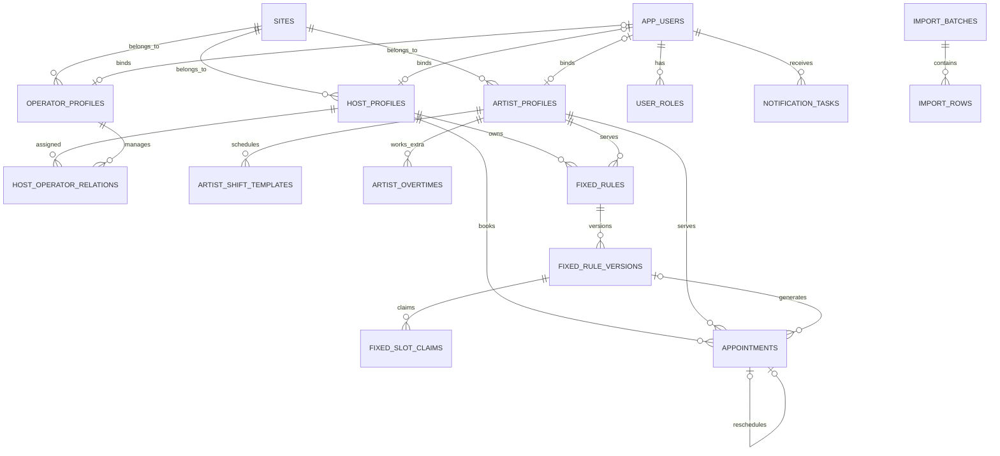

# 化妆部预约系统数据字典与数据库设计

> 文档版本：V1.0｜编制日期：2026-07-20｜数据库：PostgreSQL 18｜数据访问：Prisma 负责常规查询和事务，原生 PostgreSQL Migration 负责排斥约束、部分索引和数据库函数

---

## 1. 文档目的

本文档把《产品需求文档》和《现有数据盘点与导入规范》转换为可实施的数据模型，作为数据库迁移、后端模块、接口、测试和数据导入的共同依据。

设计重点：

1. 主播重名时仍能使用唯一编号正确识别。
2. 多人并发预约同一化妆师时只有一个请求成功。
3. 固定关系、每日预约和实际服务结果彼此独立且可追溯。
4. 改期、取消、请假、班次变化和审批不覆盖历史。
5. 场地、人员、运营关系和权限能够按有效期追踪。
6. 当前 1,500 条/日预约和数百人并发下保持简单、高效，并为后续增长保留扩展空间。

---

## 2. 硬性设计决策

### 2.1 唯一事实来源

- PostgreSQL 是人员、预约、固定关系、班次、审批和通知任务的唯一事实来源。
- Redis 只用于任务队列、限流和短时缓存，不负责最终判断档期是否冲突。
- 前端展示的空闲时间只供选择，提交时必须在数据库事务内重新校验。

### 2.2 模块化单体

- 第一阶段使用一个 PostgreSQL 数据库和一个模块化单体后端。
- 各业务模块只能通过公开服务接口交互，不允许跨模块随意修改其他模块的数据表。
- 不为预计规模提前拆分微服务或引入分布式事务。

### 2.3 历史不可覆盖

- 预约改期通过“创建新预约＋取消原预约”完成。
- 人员离职采用停用，关系变化采用结束旧记录并新增记录。
- 固定规则和班次使用版本记录，不覆盖历史版本。
- 操作日志只追加，不允许普通业务账号修改或删除。

### 2.4 时间区间约定

- 所有时间区间使用左闭右开 `[开始, 结束)`。
- 业务时区固定为 `Asia/Shanghai`。
- 时间点使用 `timestamptz` 存储为 UTC，展示时转换为上海时区。
- 单日固定时间和班次使用“从 00:00 起的分钟数”存储，范围 `0～1440`，必须是 15 的倍数。
- 数据库中的有效期结束日期统一为“不再生效的第一天”，即 `[valid_from, valid_until)`；`valid_until` 为空表示长期有效。

### 2.5 业务状态代替删除

- 人员使用在职、停用或资格状态。
- 预约只使用已预约、已取消、已完成。
- 审批申请使用待审核、已通过、已驳回、已撤回。
- 不对核心业务表实施通用 `deleted_at` 软删除；每个领域使用有明确含义的状态或有效期。

---

## 3. 命名和字段规范

### 3.1 命名

- 表名和字段名使用英文 `snake_case`。
- 表名使用复数，避免 `user` 等保留字，例如 `app_users`。
- 主键统一命名为 `id`，外键统一为 `<对象>_id`。
- 业务编号与数据库内部 ID 分开，主播业务编号为 `host_code`。

### 3.2 主键

- 核心业务表使用应用生成的 UUIDv7，数据库类型为 `uuid`。
- UUIDv7 只用于内部关联，不展示给普通用户。
- 主播编号按文本保存为 `varchar(32)`，即使当前 Excel 中全部为数值。

### 3.3 公共字段

除纯关联表和不可变事件表外，可修改业务表默认包含：

| 字段 | 类型 | 说明 |
|---|---|---|
| `created_at` | `timestamptz` | 创建时间，默认 `now()` |
| `updated_at` | `timestamptz` | 最后修改时间 |
| `row_version` | `integer` | 乐观锁版本，默认 1 |

不可变事件表只需要 `created_at`。业务数据的创建人、审核人和修改原因使用领域字段，不依赖公共字段猜测。

### 3.4 文本标准化

- 姓名和昵称保存原始展示值，同时保存经过 NFKC、去首尾空格和英文大小写折叠后的匹配值。
- 主播姓名允许重复，不能建立唯一约束。
- 化妆师当前昵称在有效人员范围内唯一。
- 运营初次导入可以按姓名匹配，入库后所有关系只保存内部 ID。

### 3.5 枚举实现

业务枚举在 TypeScript 中集中定义，并在 PostgreSQL 使用 `varchar`＋`CHECK` 约束，不创建大量 PostgreSQL Enum。这样可以在不重建枚举类型的情况下安全增加状态，同时仍由数据库阻止非法值。

### 3.6 外键与删除策略

- 人员、预约、固定关系、班次和审批之间的业务外键统一使用 `ON DELETE RESTRICT`。
- 操作人账号等非业务主体外键可使用 `ON DELETE SET NULL`，但实际运行中账号只停用、不删除。
- 只有纯从属技术数据可以级联删除，例如尚未确认导入批次的暂存行、通知任务的发送尝试。
- 所有外键列按实际查询方向建立索引，不能依赖 PostgreSQL 自动创建外键索引。
- 生产环境不得通过级联操作删除历史预约、固定规则、关系、审批和审计记录。

---

## 4. 领域关系总览



该图只展示主关系；审批、请假、通知、导入和审计的完整字段见后文。

---

## 5. 枚举字典

| 枚举 | 允许值 | 说明 |
|---|---|---|
| `site_status` | `ACTIVE`、`INACTIVE` | 场地状态 |
| `user_status` | `ACTIVE`、`DISABLED` | 登录账号状态 |
| `role_code` | `HOST`、`OPERATOR`、`ARTIST`、`CUSTOMER_SERVICE`、`ADMIN` | 用户角色 |
| `employment_status` | `ACTIVE`、`INACTIVE` | 化妆师、运营在职状态 |
| `host_qualification_status` | `ACTIVE`、`SUSPENDED`、`CANCELLED` | 主播预约资格 |
| `request_status` | `PENDING`、`APPROVED`、`REJECTED`、`WITHDRAWN` | 通用审批状态 |
| `fixed_request_type` | `CREATE`、`CHANGE`、`CANCEL` | 固定关系申请类型 |
| `fixed_mode` | `DAILY`、`SELECTED_WEEKDAYS` | 每个有效工作日或指定星期 |
| `fixed_rule_status` | `ACTIVE`、`ENDED` | 固定关系状态 |
| `slot_claim_status` | `HELD`、`RELEASED` | 长期固定档期占用状态 |
| `appointment_type` | `FIXED`、`SINGLE` | 展示用预约类型 |
| `appointment_status` | `BOOKED`、`CANCELLED`、`COMPLETED` | 预约状态 |
| `leave_status` | `ACTIVE`、`CANCELLED` | 请假状态 |
| `leave_subject_type` | `HOST`、`ARTIST` | 请假主体 |
| `notification_status` | `PENDING`、`PROCESSING`、`RETRY_WAIT`、`SENT`、`FAILED`、`CANCELLED` | 通知任务状态 |
| `import_mode` | `MERGE`、`SNAPSHOT` | 合并更新或完整快照 |
| `import_batch_status` | `UPLOADED`、`VALIDATING`、`PREVIEW_READY`、`CONFIRMED`、`IMPORTING`、`SUCCEEDED`、`FAILED` | 导入批次状态 |
| `import_row_action` | `INSERT`、`UPDATE`、`NO_CHANGE`、`END_RELATION`、`DEACTIVATE`、`REJECT` | 预览动作 |
| `actor_role` | 所有角色加 `SYSTEM` | 操作或预约发起角色 |

枚举的中文文案只存在于前端或共享文案包中，数据库只保存稳定英文代码。

---

## 6. 表结构设计

### 6.1 场地、账号与角色

#### 6.1.1 `sites` 场地主档

| 字段 | 类型 | 必填 | 约束/说明 |
|---|---|---:|---|
| `id` | `uuid` | 是 | 主键 |
| `code` | `varchar(32)` | 是 | 唯一稳定代码，例如 `SONGJIANG` |
| `name` | `varchar(64)` | 是 | 当前展示名称，唯一 |
| `timezone` | `varchar(64)` | 是 | 默认 `Asia/Shanghai` |
| `status` | `varchar(16)` | 是 | `ACTIVE`、`INACTIVE` |
| `sort_order` | `integer` | 是 | 后台排序 |

初始化松江、现厂、无锡三条记录。停用场地后不允许新增人员和预约，但保留历史。

#### 6.1.2 `app_users` 登录账号

| 字段 | 类型 | 必填 | 约束/说明 |
|---|---|---:|---|
| `id` | `uuid` | 是 | 主键 |
| `display_name` | `varchar(64)` | 是 | 账号展示名 |
| `mobile_ciphertext` | `text` | 否 | 加密手机号，不在普通日志输出 |
| `mobile_hash` | `char(64)` | 否 | 标准化手机号的不可逆哈希，用于唯一匹配 |
| `mobile_last4` | `char(4)` | 否 | 后台辅助核对 |
| `status` | `varchar(16)` | 是 | `ACTIVE`、`DISABLED` |
| `last_login_at` | `timestamptz` | 否 | 最近登录时间 |

人员可以先入主档后再绑定账号，因此各人员表的 `user_id` 允许为空。

#### 6.1.3 `user_identities` 外部登录身份

| 字段 | 类型 | 必填 | 约束/说明 |
|---|---|---:|---|
| `id` | `uuid` | 是 | 主键 |
| `user_id` | `uuid` | 是 | 外键至 `app_users` |
| `provider` | `varchar(32)` | 是 | 例如 `WECHAT_MINIPROGRAM` |
| `provider_app_id` | `varchar(128)` | 是 | 微信 AppID；其他提供方使用稳定登录域代码 |
| `external_subject` | `varchar(256)` | 是 | OpenID 或其他外部唯一身份 |
| `union_id` | `varchar(256)` | 否 | 可用时保存 |
| `status` | `varchar(16)` | 是 | `ACTIVE`、`REVOKED` |
| `bound_at` | `timestamptz` | 是 | 绑定时间 |

唯一约束：`(provider, provider_app_id, external_subject)`。不能只凭姓名绑定人员。

#### 6.1.4 `password_credentials` 后台密码凭据

| 字段 | 类型 | 必填 | 约束/说明 |
|---|---|---:|---|
| `user_id` | `uuid` | 是 | 主键并外键至 `app_users` |
| `password_hash` | `text` | 是 | 使用强密码哈希，绝不保存明文 |
| `password_changed_at` | `timestamptz` | 是 | 最近修改时间 |
| `failed_attempt_count` | `integer` | 是 | 连续失败次数 |
| `locked_until` | `timestamptz` | 否 | 临时锁定结束时间 |
| `updated_at` | `timestamptz` | 是 | 修改时间 |

客服和管理员后台账号使用本表；微信登录人员不需要创建密码凭据。

#### 6.1.5 `user_roles` 账号角色和场地范围

| 字段 | 类型 | 必填 | 约束/说明 |
|---|---|---:|---|
| `id` | `uuid` | 是 | 主键 |
| `user_id` | `uuid` | 是 | 外键至 `app_users` |
| `role_code` | `varchar(32)` | 是 | 角色代码 |
| `site_id` | `uuid` | 否 | 客服必须有场地；管理员为空代表全局 |
| `assigned_by_user_id` | `uuid` | 否 | 分配人 |
| `assigned_at` | `timestamptz` | 是 | 生效时间 |
| `revoked_at` | `timestamptz` | 否 | 撤销时间 |

同一账号可以有多个角色。有效角色为 `revoked_at IS NULL` 的记录。

#### 6.1.6 `auth_sessions` 登录会话

| 字段 | 类型 | 必填 | 约束/说明 |
|---|---|---:|---|
| `id` | `uuid` | 是 | 会话 ID |
| `user_id` | `uuid` | 是 | 外键至 `app_users` |
| `refresh_token_hash` | `char(64)` | 是 | 唯一，只保存令牌哈希，不保存原始令牌 |
| `expires_at` | `timestamptz` | 是 | 必须晚于创建时间 |
| `last_seen_at` | `timestamptz` | 否 | 最近使用时间 |
| `revoked_at` | `timestamptz` | 否 | 撤销时间 |
| `revoke_reason` | `varchar(500)` | 否 | 撤销时必填，未撤销时为空 |
| `created_at` | `timestamptz` | 是 | 创建时间 |
| `updated_at` | `timestamptz` | 是 | 修改时间 |

会话不缓存永久角色权限。每次签发访问令牌时必须从有效 `user_roles` 校验当前角色，服务端业务入口仍按角色、本人绑定关系和场地范围默认拒绝。

---

### 6.2 人员主档与关系

#### 6.2.1 `host_profiles` 主播主档

| 字段 | 类型 | 必填 | 约束/说明 |
|---|---|---:|---|
| `id` | `uuid` | 是 | 内部主键 |
| `user_id` | `uuid` | 否 | 唯一，可在后续绑定账号 |
| `host_code` | `varchar(32)` | 是 | 业务唯一，不允许重复 |
| `real_name` | `varchar(64)` | 是 | 允许重名 |
| `nickname` | `varchar(64)` | 否 | 展示和搜索 |
| `site_id` | `uuid` | 是 | 当前场地 |
| `qualification_status` | `varchar(16)` | 是 | 默认 `ACTIVE` |
| `qualification_effective_at` | `timestamptz` | 是 | 当前资格状态生效时间 |
| `source_import_batch_id` | `uuid` | 否 | 首次或最近一次批量来源 |

唯一索引：`host_code`；`real_name` 只建普通搜索索引，绝不唯一。

#### 6.2.2 `host_qualification_histories` 主播资格历史

| 字段 | 类型 | 必填 | 约束/说明 |
|---|---|---:|---|
| `id` | `uuid` | 是 | 主键 |
| `host_id` | `uuid` | 是 | 主播 |
| `from_status` | `varchar(16)` | 否 | 首次设置可空 |
| `to_status` | `varchar(16)` | 是 | 新状态 |
| `effective_at` | `timestamptz` | 是 | 生效时间 |
| `changed_by_user_id` | `uuid` | 否 | 系统导入时可空 |
| `reason` | `varchar(500)` | 否 | 修改原因 |

暂停或取消资格后禁止新增预约，未来预约如何处理必须由具体操作流程明确并记录审计。

#### 6.2.3 `artist_profiles` 化妆师主档

| 字段 | 类型 | 必填 | 约束/说明 |
|---|---|---:|---|
| `id` | `uuid` | 是 | 不可变内部 ID |
| `user_id` | `uuid` | 否 | 唯一，可后续绑定 |
| `real_name` | `varchar(64)` | 是 | 当前人员表已有 |
| `nickname` | `varchar(64)` | 是 | 展示昵称 |
| `nickname_normalized` | `varchar(64)` | 是 | 去空格、大小写折叠后的匹配值 |
| `site_id` | `uuid` | 是 | 当前所属场地 |
| `employment_status` | `varchar(16)` | 是 | 默认 `ACTIVE` |
| `initial_shift_configured_at` | `timestamptz` | 否 | 为空时不可预约 |
| `source_import_batch_id` | `uuid` | 否 | 导入来源 |

有效人员的 `nickname_normalized` 使用部分唯一索引。是否可预约仍需同时查询有效班次，而不是只看配置时间。

#### 6.2.4 `artist_aliases` 化妆师昵称历史

| 字段 | 类型 | 必填 | 约束/说明 |
|---|---|---:|---|
| `id` | `uuid` | 是 | 主键 |
| `artist_id` | `uuid` | 是 | 化妆师 |
| `alias` | `varchar(64)` | 是 | 昵称或历史别名 |
| `alias_normalized` | `varchar(64)` | 是 | 标准化匹配值 |
| `valid_from` | `date` | 是 | 生效日期 |
| `valid_until` | `date` | 否 | 结束日期，不包含 |
| `is_primary` | `boolean` | 是 | 是否为当时主昵称 |

导入历史文件时可以用别名辅助定位，但匹配到多个内部 ID 时必须报错，禁止猜测。

#### 6.2.5 `operator_profiles` 运营主档

| 字段 | 类型 | 必填 | 约束/说明 |
|---|---|---:|---|
| `id` | `uuid` | 是 | 内部主键 |
| `user_id` | `uuid` | 否 | 唯一，可后续绑定 |
| `real_name` | `varchar(64)` | 是 | 展示姓名 |
| `name_normalized` | `varchar(64)` | 是 | 初次导入匹配使用 |
| `site_id` | `uuid` | 是 | 所属场地 |
| `employment_status` | `varchar(16)` | 是 | 默认 `ACTIVE` |
| `source_import_batch_id` | `uuid` | 否 | 导入来源 |

有效运营在同一场地下的标准化姓名应唯一；业务关系只存运营 ID。

#### 6.2.6 `host_operator_relations` 主播—运营有效期关系

| 字段 | 类型 | 必填 | 约束/说明 |
|---|---|---:|---|
| `id` | `uuid` | 是 | 主键 |
| `host_id` | `uuid` | 是 | 主播 |
| `operator_id` | `uuid` | 是 | 运营；无运营时不创建关系行 |
| `valid_from` | `date` | 是 | 生效首日 |
| `valid_until` | `date` | 否 | 不再生效的第一天 |
| `change_reason` | `varchar(500)` | 否 | 分配、换组或解除原因 |
| `created_by_user_id` | `uuid` | 否 | 操作人 |
| `source_import_batch_id` | `uuid` | 否 | 导入来源 |
| `active_range` | `daterange` | 是 | 生成列 `[valid_from, valid_until)` |

约束：同一主播的有效日期范围不能重叠。查询某预约日运营时使用 `active_range @> appointment_date`。主播没有匹配关系行即表示未分配运营。

---

### 6.3 化妆师班次、加班与请假

#### 6.3.1 `artist_shift_templates` 班次版本

| 字段 | 类型 | 必填 | 约束/说明 |
|---|---|---:|---|
| `id` | `uuid` | 是 | 主键 |
| `artist_id` | `uuid` | 是 | 化妆师 |
| `version_no` | `integer` | 是 | 同一化妆师递增 |
| `workdays` | `smallint[]` | 是 | ISO 星期，周一为 1，周日为 7 |
| `work_start_minute` | `smallint` | 是 | 上班分钟数 |
| `break_start_minute` | `smallint` | 否 | 无午休时为空 |
| `break_end_minute` | `smallint` | 否 | 无午休时为空 |
| `work_end_minute` | `smallint` | 是 | 下班分钟数 |
| `valid_from` | `date` | 是 | 生效首日 |
| `valid_until` | `date` | 否 | 不再生效的第一天 |
| `created_by_user_id` | `uuid` | 否 | 本人、客服、管理员或系统 |
| `source_request_id` | `uuid` | 否 | 由审批产生时关联申请 |
| `active_range` | `daterange` | 是 | 生成列 |

检查约束：

- `workdays` 非空、不重复且全部为 1～7。
- 所有分钟值为 15 的倍数。
- 无午休时两个午休字段同时为空。
- 有午休时满足 `上班 < 午休开始 < 午休结束 < 下班`。
- 同一化妆师的班次有效期不能重叠。

#### 6.3.2 `artist_shift_change_requests` 班次修改申请

| 字段 | 类型 | 必填 | 约束/说明 |
|---|---|---:|---|
| `id` | `uuid` | 是 | 主键 |
| `artist_id` | `uuid` | 是 | 申请化妆师 |
| `site_id` | `uuid` | 是 | 提交时场地快照 |
| `current_shift_id` | `uuid` | 是 | 当前生效版本 |
| `proposed_workdays` | `smallint[]` | 是 | 新工作日 |
| `proposed_work_start_minute` | `smallint` | 是 | 新上班时间 |
| `proposed_break_start_minute` | `smallint` | 否 | 新午休开始 |
| `proposed_break_end_minute` | `smallint` | 否 | 新午休结束 |
| `proposed_work_end_minute` | `smallint` | 是 | 新下班时间 |
| `effective_from` | `date` | 是 | 最早次日 |
| `reason` | `varchar(500)` | 是 | 修改原因 |
| `status` | `varchar(16)` | 是 | 审批状态 |
| `submitted_by_user_id` | `uuid` | 是 | 提交人 |
| `submitted_at` | `timestamptz` | 是 | 提交时间 |
| `reviewed_by_user_id` | `uuid` | 否 | 审核人 |
| `reviewed_at` | `timestamptz` | 否 | 审核时间 |
| `review_comment` | `varchar(500)` | 否 | 审核意见 |
| `affected_appointment_count` | `integer` | 是 | 提交或审核时重新计算 |

待审核期间旧班次继续有效。审核通过时关闭旧版本、创建新版本并取消受影响预约，全部在同一事务内完成。

#### 6.3.3 `artist_overtimes` 非工作日加班

| 字段 | 类型 | 必填 | 约束/说明 |
|---|---|---:|---|
| `id` | `uuid` | 是 | 主键 |
| `artist_id` | `uuid` | 是 | 化妆师 |
| `site_id` | `uuid` | 是 | 场地快照 |
| `overtime_date` | `date` | 是 | 非工作日日期 |
| `work_start_minute` | `smallint` | 是 | 加班开始 |
| `break_start_minute` | `smallint` | 否 | 可无午休 |
| `break_end_minute` | `smallint` | 否 | 可无午休 |
| `work_end_minute` | `smallint` | 是 | 加班结束 |
| `reason` | `varchar(500)` | 是 | 加班原因 |
| `status` | `varchar(16)` | 是 | 审批状态 |
| `submitted_by_user_id` | `uuid` | 是 | 提交人 |
| `reviewed_by_user_id` | `uuid` | 否 | 审核人 |
| `reviewed_at` | `timestamptz` | 否 | 审核时间 |

同一化妆师、同一日期最多一条待审核或已批准加班。批准后才开放预约，不修改固定班次模板。

#### 6.3.4 `leave_records` 请假记录

| 字段 | 类型 | 必填 | 约束/说明 |
|---|---|---:|---|
| `id` | `uuid` | 是 | 主键 |
| `subject_type` | `varchar(16)` | 是 | `HOST` 或 `ARTIST` |
| `host_id` | `uuid` | 否 | 主播请假时填写 |
| `artist_id` | `uuid` | 否 | 化妆师请假时填写 |
| `start_date` | `date` | 是 | 请假首日 |
| `end_date` | `date` | 是 | 请假最后一日，包含 |
| `status` | `varchar(16)` | 是 | `ACTIVE`、`CANCELLED` |
| `reason` | `varchar(500)` | 否 | 请假原因 |
| `created_by_user_id` | `uuid` | 是 | 提交人 |
| `created_at` | `timestamptz` | 是 | 提交时间 |
| `cancelled_by_user_id` | `uuid` | 否 | 撤销人 |
| `cancelled_at` | `timestamptz` | 否 | 撤销时间 |

检查约束：`host_id` 与 `artist_id` 必须且只能填写一个；`end_date - start_date` 为 0～6。只能请未来七日及零点锁定等动态规则由服务层在事务内校验。

---

### 6.4 固定关系与长期档期

#### 6.4.1 `fixed_rules` 固定关系主体

| 字段 | 类型 | 必填 | 约束/说明 |
|---|---|---:|---|
| `id` | `uuid` | 是 | 固定关系 ID |
| `host_id` | `uuid` | 是 | 固定主播 |
| `artist_id` | `uuid` | 是 | 固定化妆师；长期换人应取消后新建 |
| `site_id` | `uuid` | 是 | 固定场地 |
| `status` | `varchar(16)` | 是 | `ACTIVE`、`ENDED` |
| `active_from` | `date` | 是 | 关系开始日 |
| `active_until` | `date` | 否 | 不再固定的第一天 |
| `created_from_request_id` | `uuid` | 是 | 新建申请 |
| `ended_from_request_id` | `uuid` | 否 | 取消申请 |
| `created_at` | `timestamptz` | 是 | 创建时间 |

同一主播的有效固定关系日期范围不能重叠。不设置暂停和恢复状态。当前规则版本按 `fixed_rule_id` 和版本有效期查询，不在主体表重复保存易失真的“当前版本指针”。

#### 6.4.2 `fixed_rule_versions` 固定规则版本

| 字段 | 类型 | 必填 | 约束/说明 |
|---|---|---:|---|
| `id` | `uuid` | 是 | 主键 |
| `fixed_rule_id` | `uuid` | 是 | 固定关系 |
| `version_no` | `integer` | 是 | 从 1 递增 |
| `mode` | `varchar(32)` | 是 | `DAILY`、`SELECTED_WEEKDAYS` |
| `weekdays` | `smallint[]` | 是 | 指定星期；每天模式保存 1～7 用于长期占位 |
| `start_minute` | `smallint` | 是 | 固定开始时间 |
| `duration_minutes` | `smallint` | 是 | 15、30、45、60 |
| `effective_from` | `date` | 是 | 版本生效日 |
| `effective_until` | `date` | 否 | 不再生效的第一天 |
| `source_request_id` | `uuid` | 是 | 创建或变更申请 |
| `created_at` | `timestamptz` | 是 | 创建时间 |

版本记录不可修改。每天模式在七个星期上占用长期档期，但只在化妆师实际工作日或批准加班日生成预约。

#### 6.4.3 `fixed_requests` 固定申请

| 字段 | 类型 | 必填 | 约束/说明 |
|---|---|---:|---|
| `id` | `uuid` | 是 | 主键 |
| `request_type` | `varchar(16)` | 是 | `CREATE`、`CHANGE`、`CANCEL` |
| `target_fixed_rule_id` | `uuid` | 否 | 修改或取消时必填 |
| `host_id` | `uuid` | 是 | 主播 |
| `proposed_artist_id` | `uuid` | 否 | 新建时填写；长期换化妆师必须取消后重新申请 |
| `site_id` | `uuid` | 是 | 申请场地 |
| `proposed_mode` | `varchar(32)` | 否 | 新建、修改时填写 |
| `proposed_weekdays` | `smallint[]` | 否 | 新建、修改时填写 |
| `proposed_start_minute` | `smallint` | 否 | 新建、修改时填写 |
| `proposed_duration_minutes` | `smallint` | 否 | 新建、修改时填写 |
| `effective_from` | `date` | 是 | 期望生效日 |
| `recommended_earliest_date` | `date` | 否 | 系统计算的最早连续开始日期 |
| `reason` | `varchar(500)` | 是 | 申请原因 |
| `status` | `varchar(16)` | 是 | 审批状态 |
| `submitted_by_operator_id` | `uuid` | 是 | 必须为申请日当前运营 |
| `submitted_by_user_id` | `uuid` | 是 | 操作账号 |
| `submitted_at` | `timestamptz` | 是 | 提交时间 |
| `reviewed_by_user_id` | `uuid` | 否 | 本场地客服或管理员 |
| `reviewed_at` | `timestamptz` | 否 | 审核时间 |
| `review_comment` | `varchar(500)` | 否 | 审核意见 |

每名主播同一时间只允许一条待审核固定新建或变更申请。撤回或驳回后释放该申请新增占用的长期档期。

#### 6.4.4 `fixed_slot_claims` 长期档期占用

为处理待审核申请、并发申请和固定规则变更，本表按 15 分钟格保存长期占用。30 分钟固定规则产生 2 个格，45 分钟产生 3 个格。

| 字段 | 类型 | 必填 | 约束/说明 |
|---|---|---:|---|
| `id` | `uuid` | 是 | 主键 |
| `artist_id` | `uuid` | 是 | 被占用化妆师 |
| `weekday` | `smallint` | 是 | 1～7 |
| `slot_minute` | `smallint` | 是 | 该 15 分钟格的开始分钟 |
| `valid_from` | `date` | 是 | 占用开始日 |
| `valid_until` | `date` | 否 | 占用结束日，不包含 |
| `fixed_rule_version_id` | `uuid` | 否 | 已生效规则版本 |
| `fixed_request_id` | `uuid` | 否 | 待审核申请新增占用 |
| `status` | `varchar(16)` | 是 | `HELD`、`RELEASED` |
| `active_range` | `daterange` | 是 | 生成列 |
| `created_at` | `timestamptz` | 是 | 创建时间 |

规则：

- `fixed_rule_version_id` 与 `fixed_request_id` 必须且只能填写一个。
- 同一化妆师、星期、15 分钟格在重叠日期范围内只能有一条 `HELD` 记录。
- 修改固定时间时，原规则已经占用的重叠格不重复申请，只为新增格创建申请占用。
- 审核通过后在事务中结束旧版本占用、将新占用归属到新版本；驳回或撤回只释放申请占用。

离散 15 分钟格比复杂的周期区间表达更容易校验、查询和维护，当前规模下数据量很小。

---

### 6.5 预约

#### 6.5.1 `appointments` 预约实例

| 字段 | 类型 | 必填 | 约束/说明 |
|---|---|---:|---|
| `id` | `uuid` | 是 | 预约 ID |
| `host_id` | `uuid` | 是 | 主播内部 ID |
| `host_code_snapshot` | `varchar(32)` | 是 | 预约时主播编号 |
| `host_name_snapshot` | `varchar(64)` | 是 | 预约时主播姓名 |
| `artist_id` | `uuid` | 是 | 实际预约化妆师 |
| `artist_nickname_snapshot` | `varchar(64)` | 是 | 预约时昵称 |
| `site_id` | `uuid` | 是 | 实际预约场地 |
| `site_name_snapshot` | `varchar(64)` | 是 | 预约时场地名 |
| `operator_id_at_booking` | `uuid` | 否 | 预约日当前运营，可空 |
| `operator_name_snapshot` | `varchar(64)` | 否 | 预约时运营姓名 |
| `appointment_date` | `date` | 是 | 上海时区业务日期 |
| `start_at` | `timestamptz` | 是 | 开始时间 |
| `end_at` | `timestamptz` | 是 | 结束时间 |
| `duration_minutes` | `smallint` | 是 | 15、30、45、60 |
| `time_range` | `tstzrange` | 是 | 生成列 `[start_at, end_at)` |
| `appointment_type` | `varchar(16)` | 是 | `FIXED`、`SINGLE` |
| `status` | `varchar(16)` | 是 | `BOOKED`、`CANCELLED`、`COMPLETED` |
| `daily_sequence` | `smallint` | 是 | 1 或 2 |
| `origin_fixed_rule_id` | `uuid` | 否 | 来自固定关系时保留血缘 |
| `origin_fixed_rule_version_id` | `uuid` | 否 | 自动生成时的规则版本 |
| `rescheduled_from_appointment_id` | `uuid` | 否 | 改期新预约指向原预约，唯一 |
| `created_by_user_id` | `uuid` | 否 | 系统生成固定预约时可空 |
| `created_by_role` | `varchar(32)` | 是 | 包含 `SYSTEM` |
| `created_at` | `timestamptz` | 是 | 创建时间 |
| `cancelled_at` | `timestamptz` | 否 | 取消时间 |
| `cancelled_by_user_id` | `uuid` | 否 | 取消人；系统取消可空 |
| `cancellation_reason_code` | `varchar(64)` | 否 | 主动取消、改期、请假、班次变化等 |
| `cancellation_reason_text` | `varchar(500)` | 否 | 补充原因 |
| `cancellation_source_type` | `varchar(32)` | 否 | `LEAVE`、`SHIFT_CHANGE`、`FIXED_CHANGE` 等 |
| `cancellation_source_id` | `uuid` | 否 | 触发取消的业务记录 |
| `completed_at` | `timestamptz` | 否 | 自动完成时间 |

检查约束：

- `duration_minutes IN (15,30,45,60)`。
- `end_at = start_at + duration_minutes`。
- `daily_sequence IN (1,2)`。
- `appointment_date = (start_at AT TIME ZONE 'Asia/Shanghai')::date`。
- 状态为已取消时必须有 `cancelled_at` 和取消原因。
- 类型为固定预约时必须有固定规则和版本；单次预约可以保留固定血缘，用于表示固定预约单日改期后的替代预约。
- 预约的主播、化妆师、开始时间、结束时间、时长和类型创建后不可原地修改；改期必须新建记录。

自动完成后记录仍占据历史时间区间，数据库排斥约束覆盖 `BOOKED` 和 `COMPLETED`，避免历史重叠被错误写入。

---

### 6.6 通知与可靠任务

#### 6.6.1 `outbox_events` 事务外盒

| 字段 | 类型 | 必填 | 约束/说明 |
|---|---|---:|---|
| `id` | `uuid` | 是 | 事件 ID |
| `event_type` | `varchar(64)` | 是 | 预约新增、取消、请假等 |
| `aggregate_type` | `varchar(32)` | 是 | 业务对象类型 |
| `aggregate_id` | `uuid` | 是 | 业务对象 ID |
| `payload` | `jsonb` | 是 | 最小必要事件数据 |
| `status` | `varchar(16)` | 是 | `PENDING`、`PUBLISHED`、`FAILED` |
| `available_at` | `timestamptz` | 是 | 可投递时间 |
| `published_at` | `timestamptz` | 否 | 已投递时间 |
| `attempt_count` | `integer` | 是 | 尝试次数 |
| `created_at` | `timestamptz` | 是 | 与业务事务同时写入 |

业务事务只写 PostgreSQL，不直接调用微信或 Redis。Worker 可靠地把外盒事件转为通知任务或队列任务。

#### 6.6.2 `notification_tasks` 通知任务

| 字段 | 类型 | 必填 | 约束/说明 |
|---|---|---:|---|
| `id` | `uuid` | 是 | 主键 |
| `deduplication_key` | `varchar(160)` | 是 | 唯一，防止重复消息 |
| `recipient_user_id` | `uuid` | 否 | 已绑定账号时填写 |
| `recipient_type` | `varchar(16)` | 是 | 主播、化妆师、运营 |
| `recipient_business_id` | `uuid` | 是 | 人员内部 ID |
| `channel` | `varchar(32)` | 是 | 小程序、公众号或短信 |
| `template_key` | `varchar(64)` | 是 | 内部模板代码 |
| `business_type` | `varchar(32)` | 是 | 预约、20:00 汇总、提前一小时等 |
| `business_id` | `uuid` | 否 | 关联预约或业务对象 |
| `scheduled_at` | `timestamptz` | 是 | 计划发送时间 |
| `payload` | `jsonb` | 是 | 已脱敏模板数据 |
| `status` | `varchar(16)` | 是 | 通知状态 |
| `attempt_count` | `integer` | 是 | 当前尝试次数 |
| `max_attempts` | `integer` | 是 | 最大次数 |
| `next_retry_at` | `timestamptz` | 否 | 下次重试 |
| `sent_at` | `timestamptz` | 否 | 成功时间 |
| `last_error_code` | `varchar(128)` | 否 | 最近错误码 |
| `last_error_message` | `varchar(500)` | 否 | 脱敏错误信息 |
| `cancelled_at` | `timestamptz` | 否 | 预约取消或改期时撤销提醒 |

#### 6.6.3 `notification_attempts` 发送尝试

| 字段 | 类型 | 必填 | 约束/说明 |
|---|---|---:|---|
| `id` | `uuid` | 是 | 主键 |
| `notification_task_id` | `uuid` | 是 | 通知任务 |
| `attempt_no` | `integer` | 是 | 从 1 递增 |
| `provider_request_id` | `varchar(128)` | 否 | 渠道请求 ID |
| `started_at` | `timestamptz` | 是 | 开始时间 |
| `finished_at` | `timestamptz` | 否 | 完成时间 |
| `success` | `boolean` | 否 | 结果 |
| `response_code` | `varchar(128)` | 否 | 渠道返回码 |
| `response_summary` | `varchar(500)` | 否 | 脱敏摘要 |

#### 6.6.4 `notification_consents` 通知授权状态

| 字段 | 类型 | 必填 | 约束/说明 |
|---|---|---:|---|
| `id` | `uuid` | 是 | 主键 |
| `user_id` | `uuid` | 是 | 用户 |
| `channel` | `varchar(32)` | 是 | 微信小程序等 |
| `template_key` | `varchar(64)` | 是 | 模板代码 |
| `status` | `varchar(16)` | 是 | 已授权、拒绝、未知等内部状态 |
| `last_granted_at` | `timestamptz` | 否 | 最近授权时间 |
| `last_checked_at` | `timestamptz` | 否 | 最近确认时间 |

具体微信能力确定后只调整渠道适配层，不改变预约主表。

---

### 6.7 导入、导出、幂等和审计

#### 6.7.1 `import_batches` 导入批次

| 字段 | 类型 | 必填 | 约束/说明 |
|---|---|---:|---|
| `id` | `uuid` | 是 | 批次 ID |
| `import_type` | `varchar(32)` | 是 | 主播、化妆师、运营、关系等 |
| `template_version` | `varchar(16)` | 是 | 模板版本 |
| `mode` | `varchar(16)` | 是 | `MERGE`、`SNAPSHOT` |
| `original_filename` | `varchar(255)` | 是 | 原文件名 |
| `file_sha256` | `char(64)` | 是 | 文件哈希 |
| `storage_key` | `varchar(500)` | 是 | 受保护对象存储位置 |
| `status` | `varchar(32)` | 是 | 批次状态 |
| `uploaded_by_user_id` | `uuid` | 是 | 上传人 |
| `confirmed_by_user_id` | `uuid` | 否 | 确认人 |
| `confirmed_at` | `timestamptz` | 否 | 确认时间 |
| `summary` | `jsonb` | 是 | 新增、更新、警告、错误等数量 |
| `failure_reason` | `varchar(500)` | 否 | 批次失败摘要 |
| `started_at` | `timestamptz` | 否 | 正式导入开始 |
| `completed_at` | `timestamptz` | 否 | 完成时间 |

相同导入类型和文件哈希的成功批次建立查询索引，用于重复上传提醒。

#### 6.7.2 `import_rows` 导入暂存行

| 字段 | 类型 | 必填 | 约束/说明 |
|---|---|---:|---|
| `id` | `uuid` | 是 | 主键 |
| `import_batch_id` | `uuid` | 是 | 批次 |
| `sheet_name` | `varchar(128)` | 是 | 来源工作表 |
| `row_number` | `integer` | 是 | Excel 行号 |
| `business_key` | `varchar(160)` | 否 | 标准化业务键 |
| `raw_data` | `jsonb` | 是 | 原始单元格值 |
| `normalized_data` | `jsonb` | 是 | 标准化值 |
| `validation_status` | `varchar(16)` | 是 | `VALID`、`WARNING`、`ERROR` |
| `errors` | `jsonb` | 是 | 字段级错误码和提示 |
| `planned_action` | `varchar(32)` | 否 | 预览动作 |
| `target_entity_id` | `uuid` | 否 | 更新目标 |
| `applied_at` | `timestamptz` | 否 | 实际写入时间 |

唯一约束：`(import_batch_id, sheet_name, row_number)`。

#### 6.7.3 `idempotency_records` 接口幂等

| 字段 | 类型 | 必填 | 约束/说明 |
|---|---|---:|---|
| `id` | `uuid` | 是 | 主键 |
| `user_id` | `uuid` | 是 | 调用人 |
| `scope` | `varchar(64)` | 是 | 接口或业务动作 |
| `idempotency_key` | `varchar(128)` | 是 | 客户端键 |
| `request_hash` | `char(64)` | 是 | 防止同键不同请求 |
| `response_status` | `integer` | 否 | 已完成响应码 |
| `response_body` | `jsonb` | 否 | 可重放的最小响应 |
| `resource_type` | `varchar(32)` | 否 | 创建的业务对象类型 |
| `resource_id` | `uuid` | 否 | 创建的对象 ID |
| `expires_at` | `timestamptz` | 是 | 过期时间 |

唯一约束：`(user_id, scope, idempotency_key)`。

#### 6.7.4 `operation_logs` 操作审计

| 字段 | 类型 | 必填 | 约束/说明 |
|---|---|---:|---|
| `id` | `uuid` | 是 | 日志 ID |
| `site_id` | `uuid` | 否 | 场地范围，管理员全局操作可空 |
| `object_type` | `varchar(32)` | 是 | 预约、固定规则、人员等 |
| `object_id` | `uuid` | 是 | 对象 ID |
| `action` | `varchar(64)` | 是 | 稳定操作代码 |
| `actor_user_id` | `uuid` | 否 | 系统操作可空 |
| `actor_name_snapshot` | `varchar(64)` | 是 | 操作时姓名或“系统” |
| `actor_role` | `varchar(32)` | 是 | 包含 `SYSTEM` |
| `reason` | `varchar(500)` | 否 | 操作原因 |
| `before_data` | `jsonb` | 否 | 修改前必要快照 |
| `after_data` | `jsonb` | 否 | 修改后必要快照 |
| `request_id` | `varchar(64)` | 否 | API 请求追踪 ID |
| `client_type` | `varchar(32)` | 否 | 小程序、Web、任务、导入 |
| `ip_address` | `inet` | 否 | 后台安全审计 |
| `user_agent` | `varchar(500)` | 否 | 客户端摘要 |
| `created_at` | `timestamptz` | 是 | 只追加 |

数据库账号权限应禁止应用执行 `DELETE operation_logs`。日志 JSON 必须脱敏，不保存令牌、密码和完整手机号。

#### 6.7.5 `export_jobs` 排班导出任务

| 字段 | 类型 | 必填 | 约束/说明 |
|---|---|---:|---|
| `id` | `uuid` | 是 | 任务 ID |
| `requested_by_user_id` | `uuid` | 是 | 请求人 |
| `site_id` | `uuid` | 否 | 单场地或全场地 |
| `schedule_date` | `date` | 是 | 导出日期 |
| `status` | `varchar(16)` | 是 | 待处理、处理中、成功、失败 |
| `storage_key` | `varchar(500)` | 否 | 结果文件位置 |
| `row_count` | `integer` | 否 | 导出行数 |
| `expires_at` | `timestamptz` | 否 | 下载失效时间 |
| `failure_reason` | `varchar(500)` | 否 | 失败摘要 |

#### 6.7.6 `system_settings` 业务参数

| 字段 | 类型 | 必填 | 约束/说明 |
|---|---|---:|---|
| `key` | `varchar(64)` | 是 | 主键 |
| `value` | `jsonb` | 是 | 结构化配置 |
| `description` | `varchar(500)` | 是 | 配置说明 |
| `updated_by_user_id` | `uuid` | 是 | 修改人 |
| `updated_at` | `timestamptz` | 是 | 修改时间 |

首期建议参数：可预约天数 7、固定生成覆盖 8 日、每日汇总时间 20:00 和业务时区。每天最多 2 次属于数据库和代码共同固定的核心规则，不作为可随意修改的运行时配置。其他参数也需在代码中设置安全边界，防止错误配置。

---

## 7. 数据库关键约束

### 7.1 扩展

```sql
CREATE EXTENSION IF NOT EXISTS btree_gist;
```

该扩展用于把 UUID、星期和分钟格与 PostgreSQL 范围类型组合到 GiST 排斥约束中。

### 7.2 化妆师预约时间排斥

```sql
ALTER TABLE appointments
ADD CONSTRAINT appointments_artist_time_excl
EXCLUDE USING gist (
  artist_id WITH =,
  time_range WITH &&
)
WHERE (status IN ('BOOKED', 'COMPLETED'));
```

同一化妆师的有效或已完成预约不允许有任何重叠，数据库作为最终兜底。

### 7.3 主播预约时间排斥

```sql
ALTER TABLE appointments
ADD CONSTRAINT appointments_host_time_excl
EXCLUDE USING gist (
  host_id WITH =,
  time_range WITH &&
)
WHERE (status IN ('BOOKED', 'COMPLETED'));
```

防止同一主播同时出现在两名化妆师的排班中。

### 7.4 每日预约序号

```sql
CREATE UNIQUE INDEX appointments_host_day_sequence_uq
ON appointments (host_id, appointment_date, daily_sequence)
WHERE status IN ('BOOKED', 'COMPLETED');
```

配合 `daily_sequence IN (1,2)`，数据库最多允许两条有效预约。取消后序号可以重新使用；改期替代预约继承原序号。

### 7.5 固定预约防重复生成

```sql
CREATE UNIQUE INDEX appointments_fixed_occurrence_uq
ON appointments (origin_fixed_rule_version_id, appointment_date)
WHERE appointment_type = 'FIXED';
```

同一固定规则版本、同一日期即使任务重试也只会生成一次。请假导致固定预约取消后，同一版本和日期不会被后台任务错误重建。

### 7.6 主播运营关系有效期

```sql
ALTER TABLE host_operator_relations
ADD CONSTRAINT host_operator_relations_date_excl
EXCLUDE USING gist (
  host_id WITH =,
  active_range WITH &&
);
```

### 7.7 固定 15 分钟格排斥

```sql
ALTER TABLE fixed_slot_claims
ADD CONSTRAINT fixed_slot_claims_excl
EXCLUDE USING gist (
  artist_id WITH =,
  weekday WITH =,
  slot_minute WITH =,
  active_range WITH &&
)
WHERE (status = 'HELD');
```

待审核申请和已生效固定规则共享该约束，保证同一长期档期先到先得。

### 7.8 有效期约束

- 所有 `[valid_from, valid_until)` 表必须满足 `valid_until IS NULL OR valid_until > valid_from`。
- 同一化妆师班次版本有效期不得重叠。
- 同一主播固定关系有效期不得重叠。
- 同一固定关系的规则版本有效期不得重叠。
- 动态的“只能预约明日起未来七日”和“当天 00:00 后锁定”不能用依赖当前时间的 `CHECK` 实现，必须由服务层事务校验并通过集成测试保护。

---

## 8. 规则的最终执行层

| 业务规则 | 前端 | 服务层 | 数据库最终约束 |
|---|---:|---:|---:|
| 主播只能预约本人 | 提示/隐藏 | 是 | — |
| 运营只能预约有效关系内主播 | 提示/筛选 | 是，按预约日期查询关系 | — |
| 客服按场地隔离 | 页面过滤 | 是 | 数据库账号不是按客服拆分，不能只依赖数据库 |
| 主播资格正常 | 提示 | 是，事务内重查 | — |
| 主播与实际化妆师场地一致 | 可选列表按场地过滤 | 是，事务内重查 | — |
| 化妆师已配置班次 | 不展示 | 是 | — |
| 工作日、午休、加班和请假 | 只展示可选项 | 是，事务内重算 | — |
| 化妆师时间不重叠 | 显示空闲 | 是 | GiST 排斥约束 |
| 主播时间不重叠 | 提示 | 是 | GiST 排斥约束 |
| 每日最多两次 | 第二次提醒 | 是 | 序号检查＋部分唯一索引 |
| 固定长期档期不重叠 | 颜色提示 | 是 | 固定格排斥约束 |
| 当天 00:00 后锁定 | 禁用按钮 | 是 | — |
| 请求重复点击 | 禁用提交 | 是 | 幂等记录唯一索引 |

没有数据库最终约束的动态或权限规则必须在服务层集中实现，不能散落在控制器和前端。

---

## 9. 并发与事务设计

### 9.1 锁顺序

需要同时锁定主播和化妆师时，统一顺序为：

1. 获取主播事务级 advisory lock。
2. 获取化妆师事务级 advisory lock。
3. 重新查询资格、班次、请假、固定占用和预约。
4. 写入数据。

所有接口保持同一顺序，避免死锁。锁只存在于短事务中，事务内不进行微信、对象存储或其他网络调用。

### 9.2 新建预约事务

1. 校验幂等键和操作权限。
2. 锁定主播，再锁定化妆师。
3. 校验预约日期为明日起未来七日。
4. 查询主播资格、预约日运营关系、化妆师班次、加班和双方请假。
5. 查询固定格和现有预约，计算完整区间是否可用。
6. 分配 `daily_sequence`；已有一次时返回第二次提醒确认所需数据，确认请求才继续。
7. 插入预约，由数据库排斥约束和唯一索引最终判定。
8. 插入操作日志、外盒事件和一小时前提醒任务数据。
9. 提交事务后异步发送通知。

若排斥约束失败，统一转换为 `ARTIST_SLOT_CONFLICT` 或 `HOST_TIME_CONFLICT`，前端刷新可用时间。

### 9.3 改期事务

1. 锁定原预约、主播和新化妆师。
2. 确认原预约仍为已预约且未进入预约日 00:00。
3. 在锁内完整校验新档期；统一的主播、化妆师 advisory lock 会阻止其他事务抢走已校验档期。
4. 把原预约更新为 `CANCELLED`，原因设为改期，释放原 `daily_sequence`。
5. 新建 `SINGLE` 预约，继承原序号，填写 `rescheduled_from_appointment_id`。
6. 取消旧提醒，创建新提醒、即时通知和审计记录。
7. 任一步失败整笔回滚，原预约自动恢复为有效状态。

数据库部分唯一索引不允许新旧预约同时占用同一日序号，因此事务内先锁定并校验新档期，再取消旧记录、插入新记录。外部观察不到事务中间状态，仍满足“新档期失败时原预约不变”。

### 9.4 单日取消事务

1. 锁定预约并重查状态和零点规则。
2. 更新为已取消，填写取消字段。
3. 撤销一小时前提醒。
4. 写入日志和三方通知事件。
5. 固定预约只取消实例，不修改固定规则或规则版本。

### 9.5 请假事务

- 主播请假：锁定主播，创建请假记录，锁定并取消日期范围内该主播所有有效预约。
- 化妆师请假：锁定化妆师，创建请假记录，锁定并取消范围内该化妆师所有有效预约。
- 每条取消预约保存 `cancellation_source_type='LEAVE'` 和请假记录 ID。
- 固定规则和固定长期占用不变；请假结束后按原规则继续生成。
- 受影响预约、审计和通知外盒事件在同一事务内写入。

### 9.6 固定申请提交

1. 校验发起人是预约日当前运营。
2. 锁定主播，再锁定化妆师。
3. 查询固定格，排除目标规则自身已占用的格。
4. 查询未来单次预约，计算 `recommended_earliest_date`。
5. 插入申请，并为新增长期格插入 `fixed_slot_claims`。
6. 排斥约束冲突时，后提交者失败并刷新可固定时间。

### 9.7 固定审批通过

- 新建：创建固定关系和版本，把申请格转为版本格，生成滚动窗口内预约。
- 修改：关闭旧版本有效期，创建新版本；保留重叠格、结束旧格、把新增申请格转为新版本格；取消生效日之后尚未执行的旧固定预约并重新生成。
- 取消：设置固定关系和当前版本的结束日期，结束未来长期格，取消结束日之后未执行的固定预约。
- 审批、规则、预约、日志和外盒事件必须在同一数据库事务内完成。

### 9.8 班次修改审批

审核通过时锁定化妆师，关闭旧班次版本、创建新版本，查询生效日之后不再落入有效工作区间的预约并取消。固定关系不取消；未来重新满足条件的日期继续生成固定预约。

### 9.9 导入事务

导入校验在暂存表完成；只有无阻断错误并由管理员确认后，才在一个事务中写入对应业务表、操作日志和必要外盒事件。任何一行失败整批回滚，`import_rows` 保留失败位置和原因。

---

## 10. 可预约时间计算

可预约时间不提前存成大量“空闲档期”记录，而是按请求日期计算：

1. 获取预约日有效班次版本。
2. 判断该星期是否为工作日；若不是，查询已批准加班。
3. 得到上班区间并扣除午休。
4. 扣除化妆师请假。
5. 扣除长期固定格。
6. 扣除状态为已预约或已完成的预约区间。
7. 按 15 分钟粒度生成可选开始时间，并根据所选 15、30、45、60 分钟再次判断完整区间。
8. 提交时在事务内重复同样校验。

主播资格、主播请假、主播已有预约次数和主播自身时间冲突在提交层校验，不影响“化妆师空闲时间”基础列表的缓存。

可对“化妆师＋日期＋班次版本”结果做短时缓存；预约、取消、请假、加班、班次或固定规则变化后按化妆师和日期主动失效。缓存失效失败不影响最终正确性。

---

## 11. 固定预约生成

- 始终保证未来至少 8 日的固定预约实例存在，覆盖用户可预约的未来 7 日。
- 定时任务每天补齐新进入窗口的日期。
- 固定审批通过、规则修改、加班批准、班次变化后立即重算受影响日期。
- 非工作日且无批准加班时不生成记录，也不生成已取消记录。
- 生成任务以 `(固定规则版本, 日期)` 唯一索引保证幂等。
- 主播或化妆师请假导致固定预约取消后，同一版本和日期不得自动重建。
- 如果生成时发现违反数据库约束，任务进入人工可见的失败队列，不能静默跳过。

---

## 12. 预约状态与定时任务

### 12.1 自动完成

后台任务周期性执行：

```text
status = BOOKED AND end_at <= now()
```

更新为 `COMPLETED` 并填写 `completed_at`。任务可重复执行，状态条件保证幂等。排斥约束同时覆盖已预约和已完成，因此状态变化不会释放历史时间段。

### 12.2 每天 20:00 汇总

- 以查询执行时的次日数据生成主播、运营和化妆师通知任务。
- 运营汇总按次日有效运营关系确定人员范围，必须包含无预约主播。
- 未绑定账号或没有可用通知授权的对象仍创建失败可见的任务记录，不静默遗漏。
- 20:00 后至 00:00 的变化另外生成即时变更通知。

### 12.3 一小时前提醒

- 新预约创建对应提醒任务。
- 取消后把未发送提醒设为 `CANCELLED`。
- 改期撤销旧提醒并创建新提醒。
- 已经过“提前一小时”时点的未来预约不补发旧时点提醒，只发送预约变更即时通知。

---

## 13. 查询与索引

### 13.1 预约索引

| 索引 | 用途 |
|---|---|
| `(site_id, appointment_date, start_at)`，排除已取消 | 客服场地日排班和导出 |
| `(artist_id, appointment_date, start_at)`，排除已取消 | 化妆师日排班 |
| `(host_id, appointment_date, start_at)` | 主播和运营查询 |
| `(status, end_at)`，仅 `BOOKED` | 自动完成任务 |
| `(origin_fixed_rule_version_id, appointment_date)` | 固定生成和重算 |
| `(rescheduled_from_appointment_id)` 唯一 | 改期链路 |

### 13.2 关系和申请索引

- `host_operator_relations(host_id, valid_from DESC)`。
- `host_operator_relations(operator_id, valid_from, valid_until)`。
- `fixed_requests(site_id, status, submitted_at)`。
- `artist_shift_change_requests(site_id, status, submitted_at)`。
- `artist_overtimes(site_id, status, overtime_date)`。
- `fixed_slot_claims(artist_id, weekday, slot_minute)`，仅 `HELD`。

### 13.3 通知和审计索引

- `notification_tasks(status, scheduled_at)` 用于 Worker 抢取。
- `notification_tasks(recipient_business_id, scheduled_at DESC)` 用于消息中心。
- `operation_logs(object_type, object_id, created_at DESC)`。
- `operation_logs(site_id, created_at DESC)`。
- `outbox_events(status, available_at)`，仅待处理。

第一期不进行表分区。预约量持续增长且单表达到实际性能阈值后，再根据查询和监控数据评估按月分区，不能提前增加维护复杂度。

---

## 14. 数据快照与历史展示

预约保存主播编号、主播姓名、化妆师昵称、场地名称和运营姓名快照，原因如下：

- 人员改名、换昵称或场地改名后，历史排班仍显示当时内容。
- 当前关系和人员主档用于权限与新业务判断，不能反向覆盖历史。
- 排班导出直接使用预约快照，避免跨多张历史表还原。

内部 ID 同时保留，用于查看当前人员资料和聚合统计。快照只在预约创建时写入，后续不跟随主档变化。

---

## 15. 权限数据范围

| 角色 | 数据范围判断 |
|---|---|
| 主播 | `host_profiles.user_id = current_user_id` |
| 运营 | 目标日期存在 `host_operator_relations` 有效关系且运营账号匹配 |
| 化妆师 | `artist_profiles.user_id = current_user_id` |
| 客服 | 有效 `user_roles` 中 `role_code=CUSTOMER_SERVICE` 且 `site_id` 匹配 |
| 管理员 | 有效 `ADMIN` 角色，允许全场地 |

每个查询服务都必须显式接收权限上下文。导出、审批、日志和批量导入不能使用绕过场地过滤的普通仓储方法。

---

## 16. 数据导入映射

| 当前文件 | 目标表 | 迁移处理 |
|---|---|---|
| 线下主播人员表 | `host_profiles` | 编号转文本；默认资格正常；重名保留 |
| 化妆师人员表 | `artist_profiles`、`artist_aliases` | 生成 UUID；当前昵称建立主别名；班次保持未配置 |
| 运营人员表 | `operator_profiles` | 生成 UUID；以当前主档中的人员为准 |
| 主播与运营对应表 | `host_operator_relations` | 精确匹配时建关系；无法匹配的 75 行按未分配处理，不建关系行；批次参数提供生效日 |
| 化妆师固定主播名单 | 不导入 | 文件只作历史参考，不写入固定规则、预约或导入暂存业务批次 |

首次迁移导入的每条业务记录保存 `source_import_batch_id`，后续修改通过操作日志追踪。

---

## 17. 数据安全、备份与保留

- Excel 原文件、导入暂存数据、手机号和微信身份属于受保护数据，不进入 Git。
- 手机号加密保存；应用日志和审计 JSON 不输出完整敏感值。
- 数据库应用账号使用最小权限；迁移账号与运行账号分离。
- 生产迁移前先备份，不在应用启动时无条件执行数据库迁移。
- 数据库每日自动备份，并定期验证恢复。
- 预约、固定规则、关系、审批和操作日志不因人员停用而级联删除。
- 对象存储中的导入和导出文件设置访问控制与过期策略。

---

## 18. 数据库测试清单

### 18.1 约束测试

- 同一主播编号重复插入失败。
- 重名主播不同编号可以同时存在。
- 同一化妆师重叠预约只有一条成功。
- 同一主播跨化妆师重叠预约失败。
- 同一主播同日序号 1、2 可以存在，序号 3 或重复序号失败。
- 已取消预约不占时间和每日序号；已完成预约继续占历史时间。
- 同一主播运营关系有效期重叠失败。
- 同一长期固定 15 分钟格日期重叠失败。
- 同一固定规则版本和日期重复生成失败。

### 18.2 事务测试

- 改期新档期失败时原预约仍为已预约。
- 化妆师请假取消全部受影响预约但不结束固定关系。
- 班次修改审批失败时旧班次和预约均不变化。
- 固定审批任一步失败时申请占用、规则和预约全部回滚。
- 导入某行失败时业务主表不出现部分写入。
- 外部微信不可用时业务事务仍可成功，通知进入重试或失败列表。

### 18.3 并发测试

- 100 个请求同时预约同一化妆师同一档期，只有一个成功。
- 多个请求同时为同一主播创建第二次预约，最终最多两条有效预约。
- 两个运营同时申请同一长期固定格，只有一个申请占位成功。
- 固定申请和单次预约同时竞争时，通过统一 advisory lock 和最终约束得到确定结果。

---

## 19. 实施顺序

1. 建立 `sites`、账号、角色和人员主档表。
2. 建立导入暂存、批次和操作日志，先完成五张名单预检与主档迁移。
3. 建立运营关系有效期约束；无法匹配运营主档的记录按未分配处理。
4. 建立化妆师班次、班次申请、加班和请假。
5. 建立固定规则、版本、申请和长期 15 分钟格占用。
6. 建立预约表、范围生成列、GiST 排斥约束和每日序号索引。
7. 建立幂等、事务外盒、通知任务和发送尝试记录。
8. 实现固定生成、自动完成、20:00 汇总和一小时前提醒任务。
9. 完成导出任务、审计查询和数据质量检查。
10. 运行迁移、集成、并发和恢复测试后进入并行排班验证。

---

## 20. 仍需在开发前确认的外部决策

以下决定不改变核心数据库结构，但会影响账号和通知适配层：

1. 登录绑定采用手机号验证、一次性绑定码或两者结合。
2. 微信通知最终使用哪种可用消息能力，以及授权失败时是否启用短信。
3. 加班申请是否设置自动失效时间；当前默认一直待审核，直至通过、驳回或撤回。

手机端已经确认采用 Taro＋React 微信小程序。现有无法匹配的运营关系已经确定按未分配处理；固定主播名单已经确定不进入数据库，因此这些事项不再是生产迁移待决项。

---

## 21. 设计结论

该模型使用内部 UUID 保证人员身份稳定，使用有效期和版本保存关系历史，使用 PostgreSQL 排斥约束保证预约并发正确，并使用离散 15 分钟格解决固定规则和待审核申请的长期档期占用。核心业务数据保持结构化，JSON 只用于导入原始值、通知载荷和审计快照。

第一阶段无需微服务、分库或提前分区。按照本文档的事务、索引和约束实施，即可满足当前和可预见规模，同时保持代码精简、边界清晰和易于维护。
