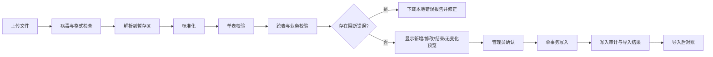

# 化妆部预约系统现有数据盘点与导入规范

> 文档版本：V1.0｜盘点日期：2026-07-20｜适用范围：首次上线迁移、上线后的人员主档批量更新、导入预检与数据质量验收

---

## 1. 文档目的

本文档基于项目 `data/source/` 目录中的五张实际 Excel 名单，明确：

1. 当前数据的真实字段、数量和质量情况。
2. 上线前必须解决的数据问题。
3. 五类数据的唯一识别方式、标准模板和校验规则。
4. 导入的预检、确认、写入、回滚和审计流程。
5. 上线后系统后台与 Excel 之间的数据职责边界。

本文档只记录结构、数量和问题汇总，不把人员姓名、主播编号等明细复制进 Git。具体异常明细应由本地导入预检报告按文件、工作表和行号展示，报告不得提交到公共仓库。

---

## 2. 盘点范围与方法

### 2.1 数据文件

| 文件 | SHA-256 | 用途 |
|---|---|---|
| `线下主播人员表.xlsx` | `EC7DF91803462E1E5FFAF5ACA0C60BBADB5441FA4E7102C7911A527B1C5A58E6` | 主播主档 |
| `化妆师人员表.xlsx` | `E48930BAEAB7775E3EEEC133E123F5E6B2B8372DDB5EF31587428F81F4038E3F` | 化妆师主档 |
| `运营人员表.xlsx` | `343C39088E5E274927D4302E78108C851EA180147E1011FEF5509BECE212E9B5` | 运营主档 |
| `主播与运营对应表.xlsx` | `C53B4FE45A14C4E0DA51A4B1E3E71AD4BD61CE0E3B1E76BF0D3890CB58B75581` | 主播与运营关系 |
| `化妆师固定主播名单.xlsx` | `1CCB3B33117FCA461238AB61B5FA867BA2FC44AD1DDE1FA84F44BACB2C8787F0` | 历史参考文件，不进入数据库 |

哈希仅用于确认本次盘点对应的文件版本；任何文件变化后都必须重新执行预检，不能沿用本次结论。

### 2.2 检查方法

本次检查覆盖：

- 工作表、表头、行列范围和空工作表。
- 必填字段空值、首尾空格和源单元格数据类型。
- 主键和业务键重复。
- 主播重名情况。
- 主播、运营、化妆师和固定关系的跨表引用。
- 主播与运营、主播与固定化妆师的场地一致性。
- 场地枚举合法性。
- 现有字段是否足以迁移完整业务模型。

---

## 3. 盘点结论摘要

| 数据集 | 有效数据行 | 当前字段 | 空必填字段 | 关键结论 |
|---|---:|---|---:|---|
| 主播主档 | 1,168 | 主播编号、主播姓名、场地 | 0 | 编号无重复；存在 19 组重名主播，必须按编号识别 |
| 化妆师主档 | 49 | 真实姓名、化妆师昵称、场地 | 0 | 真实姓名和昵称均无重复；昵称可用于本次首次匹配 |
| 运营主档 | 109 | 运营姓名、场地 | 0 | 姓名无重复，但运营关系表引用了主档之外的值 |
| 主播—运营关系 | 1,168 | 主播编号、运营 | 0 | 主播编号完整且无重复；75 行无法匹配的运营按未分配处理 |
| 固定主播名单 | 338 | 固定主播编号、化妆师昵称 | 0 | 仅保留为历史参考，不导入、不参与系统固定关系初始化 |

场地分布：

| 人员类型 | 松江 | 现厂 | 无锡 | 合计 |
|---|---:|---:|---:|---:|
| 主播 | 685 | 483 | 0 | 1,168 |
| 化妆师 | 29 | 20 | 0 | 49 |
| 运营 | 71 | 38 | 0 | 109 |

当前五张工作簿均包含 `Sheet1`、`Sheet2`、`Sheet3`，只有 `Sheet1` 有数据，另外两个工作表为空。现有场地值只出现“松江”和“现厂”，均为合法值；“无锡”尚无人员数据。

---

## 4. 各文件详细盘点

### 4.1 线下主播人员表

当前范围为 `Sheet1!A1:C1169`，第 1 行为表头，数据行 1,168 条。

| 当前列 | 源类型 | 结果 | 目标字段 |
|---|---|---|---|
| 主播编号 | Excel 数值 | 全部非空、唯一，当前长度 2～8 位 | `host_profiles.host_code` |
| 主播姓名 | 文本 | 全部非空，存在 19 组重名 | `host_profiles.real_name` |
| 场地 | 文本 | 全部非空，仅松江、现厂 | `host_profiles.site_id` |

要求：

- 主播编号虽然当前保存为数值，导入后必须作为文本保存，不能进行数学运算。
- 姓名不能作为去重、登录绑定、预约或关系匹配依据。
- 本次 19 组重名属于允许的业务现象，不是需要删除的重复数据。
- 新模板必须将“主播编号”列设置为文本，避免科学计数法和前导零丢失。

### 4.2 化妆师人员表

当前范围为 `Sheet1!A1:C50`，数据行 49 条。

| 当前列 | 源类型 | 结果 | 目标字段 |
|---|---|---|---|
| 姓名 | 文本 | 非空且无重复 | `artist_profiles.real_name` |
| 化妆师 | 文本 | 昵称非空且无重复 | `artist_profiles.nickname` |
| 场地 | 文本 | 非空且合法 | `artist_profiles.site_id` |

要求：

- 首次导入由系统为每名化妆师生成不可变内部 ID。
- 当前昵称可用于首次匹配固定名单，但上线后任何关系必须保存内部 ID，不继续依赖昵称。
- 昵称修改时保留旧昵称为历史别名，避免历史数据和旧导入文件失去匹配依据。
- 人员表不包含班次；所有化妆师首次登录或由客服、管理员代设班次前，均保持“不可预约”。

### 4.3 运营人员表

当前范围为 `Sheet1!A1:B110`，数据行 109 条。

| 当前列 | 源类型 | 结果 | 目标字段 |
|---|---|---|---|
| 运营 | 文本 | 非空且无重复 | `operator_profiles.real_name` |
| 场地 | 文本 | 非空且合法 | `operator_profiles.site_id` |

要求：

- 首次导入由系统生成运营内部 ID。
- 本次初始数据中姓名唯一，因此可用于首次匹配；上线后使用内部 ID 维护关系。
- 人员重名在未来可能发生，新导入模板应优先携带系统运营 ID；没有系统 ID 时，至少使用“姓名＋场地”匹配且必须唯一。

### 4.4 主播与运营对应表

当前范围为 `Sheet1!A1:B1169`，数据行 1,168 条。

检查结果：

- 每个主播编号恰好出现一次。
- 所有主播编号都能匹配主播主档，主播主档也没有遗漏关系行。
- 1,093 行能匹配有效运营主档，且这些可匹配关系的主播场地与运营场地全部一致。
- 75 行无法匹配运营主档，共涉及 28 种原始值。
- 无法匹配的数据中包含 `0`、`总后台`、`松江(总)`、`现厂(总)` 等明显占位或汇总值，共 11 行；其余 64 行为不在当前运营主档中的姓名引用。
- 运营列同时存在文本和数值类型，其中数值来自 `0` 占位。

处理要求：

1. 不得按名称模糊匹配，也不得自动选择相似姓名。
2. 能精确匹配运营主档的 1,093 行建立有效运营关系。
3. 无法精确匹配的 75 行统一按“未分配运营”处理，不创建关系记录，数据库表现为 `NULL`。
4. 原始运营值仍保存在受保护的导入暂存和批次报告中，方便以后核对，但不写入业务关系字段。
5. 主播可以在没有运营关系时自行预约；后续分配运营时再由后台建立有效期关系。

### 4.5 化妆师固定主播名单

当前范围为 `Sheet1!A1:B339`，数据行 338 条。

检查结果：

- 固定主播编号无重复，全部能匹配主播主档。
- 化妆师列使用昵称，全部能匹配当前化妆师主档。
- 330 行主播场地与化妆师场地一致。
- 8 行主播场地与固定化妆师场地不一致，违反“预约场地以化妆师场地为准且固定双方同场地”的规则。
- 文件只有“主播—化妆师归属”，缺少固定星期、开始时间、时长、开始日期，不能直接生成可执行固定规则。

处理要求：

1. 文件原样保留在项目的受保护数据目录中，只作为人工查询历史归属的参考。
2. 338 条记录均不导入 `fixed_rules`、`fixed_rule_versions` 或预约表。
3. 文件中的 8 条跨场地数据不再构成系统迁移阻断项，因为系统不会使用这些关系生成排班。
4. 这些主播上线后由主播本人或所属场地客服按实际需要创建单次预约。
5. 未来需要建立新的长期固定关系时，仍按系统内“运营申请、客服审核”的正式流程产生，不能从该 Excel 恢复或覆盖。

---

## 5. 上线前数据阻断项

| 优先级 | 问题 | 影响 | 完成标准 |
|---|---|---|---|
| P0 | 无化妆师班次数据 | 所有化妆师初始均不可预约 | 上线前完成首次班次设置，或分批开放化妆师 |
| P1 | 无账号、手机号或微信身份 | 无法自动完成用户登录绑定 | 确定登录绑定流程并由本人或管理员完成绑定 |
| P1 | 无主播资格状态 | 无法识别暂停或取消资格人员 | 首次导入默认正常，并另行提供异常资格清单 |
| P1 | 无客服、管理员名单 | 无法配置审批和场地权限 | 上线前创建管理员及各场地客服账号 |

以上 P0 项全部关闭前，可以开发和测试，但不能把现有数据标记为“可直接生产迁移”。

---

## 6. 数据所有权与更新原则

### 6.1 上线前

- 主播、化妆师、运营和主播—运营对应表是首次迁移来源；固定主播名单仅作历史参考。
- 导入只写入预发布或迁移环境，经过差异核对后再进入生产环境。
- 每次重新导入都要记录文件哈希、上传人、预检结果和确认人。

### 6.2 上线后

- 系统数据库是人员、关系、固定规则和预约的唯一事实来源。
- 日常少量新增、停用、换场地、换运营通过管理后台完成。
- Excel 只作为受控批量导入工具，不能绕过权限、审批或业务约束。
- 人员和历史关系不得物理删除；离职采用停用，换运营采用结束旧关系并建立新关系。
- 现有固定主播名单不参与首次迁移，也不提供上线后的覆盖导入。

### 6.3 导入模式

| 模式 | 默认权限 | 行为 | 适用场景 |
|---|---|---|---|
| 合并更新 `MERGE` | 管理员 | 新增或更新文件中出现的记录；缺失记录不自动停用 | 日常批量更新，默认模式 |
| 完整快照 `SNAPSHOT` | 管理员二次确认 | 计算新增、修改、未变化和拟停用；确认后才结束缺失记录 | 首次迁移或经过批准的全量同步 |

完整快照模式不得直接删除数据。当拟停用人数超过总人数的 5% 或 20 人中的较小值时，系统必须显示高风险警告并要求再次确认。

---

## 7. 标准导入模板

新模板统一要求：

- 有效数据工作表名称为 `数据`。
- 第 1 行只能放标准表头，不允许合并单元格和多层标题。
- 不允许隐藏关键列，不允许在关键字段中使用公式。
- 空白行可以位于数据末尾，数据中间的整行空白忽略。
- 文件扩展名只接受 `.xlsx`，单文件大小上限建议 10 MB，数据行上限建议 20,000。
- 模板包含 `模板版本`，导入器按版本解析，未知版本拒绝导入。

### 7.1 主播主档模板

| 字段 | 必填 | 格式 | 说明 |
|---|---:|---|---|
| 主播编号 | 是 | 文本，1～32 字符 | 业务唯一，禁止首尾空格 |
| 主播姓名 | 是 | 文本，1～64 字符 | 允许重名 |
| 主播昵称 | 否 | 文本，最多 64 字符 | 展示使用 |
| 场地 | 是 | 有效场地名称或代码 | 必须能唯一匹配场地主档 |
| 预约资格 | 否 | 正常、暂停、取消 | 首次为空时默认正常 |

### 7.2 化妆师主档模板

| 字段 | 必填 | 格式 | 说明 |
|---|---:|---|---|
| 化妆师系统 ID | 更新时建议 | UUID | 首次导入可空，上线后优先使用 |
| 真实姓名 | 是 | 文本，1～64 字符 | 人员资料 |
| 化妆师昵称 | 是 | 文本，1～64 字符 | 有效人员范围内唯一 |
| 场地 | 是 | 有效场地名称或代码 | 当前所属场地 |
| 在职状态 | 否 | 在职、停用 | 首次为空时默认在职 |

### 7.3 运营主档模板

| 字段 | 必填 | 格式 | 说明 |
|---|---:|---|---|
| 运营系统 ID | 更新时建议 | UUID | 首次导入可空，上线后优先使用 |
| 运营姓名 | 是 | 文本，1～64 字符 | 不能作为永久主键 |
| 场地 | 是 | 有效场地名称或代码 | 当前所属场地 |
| 在职状态 | 否 | 在职、停用 | 首次为空时默认在职 |

### 7.4 主播—运营关系模板

| 字段 | 必填 | 格式 | 说明 |
|---|---:|---|---|
| 主播编号 | 是 | 文本 | 必须匹配主播主档 |
| 运营系统 ID | 建议 | UUID | 上线后首选匹配字段 |
| 运营姓名 | 条件必填 | 文本 | 无系统 ID 时使用 |
| 运营场地 | 条件必填 | 场地 | 与姓名共同消除重名歧义 |
| 生效日期 | 是 | `yyyy-mm-dd` | 当日开始生效 |
| 是否解除运营 | 是 | 是、否 | 为“是”时运营字段必须为空 |

同一主播在同一日期只能有一个有效运营。新关系生效时，系统在同一事务中结束旧关系。

### 7.5 不提供固定关系导入模板

现有固定主播名单不导入数据库，因此第一期不开发固定关系 Excel 导入模板。固定关系表仍保留在系统设计中，用于上线后由运营提交、客服审核的新固定关系。

现有名单中的主播需要化妆时，由主播本人或所属场地客服创建单次预约；预约仍受可预约日期、每日最多两次、班次、请假、场地和时间冲突等全部规则约束。

---

## 8. 标准化规则

导入器保留原始值，同时生成标准化值用于校验和匹配：

1. 文本执行 Unicode NFKC 标准化并删除首尾空格。
2. 不删除姓名、昵称中间的合法空格，不自动替换同音字、繁简体或英文名。
3. 主播编号一律转为文本；禁止科学计数法结果和小数编号。
4. 场地通过场地代码或精确名称匹配，不做包含匹配。
5. 时间统一解析为上海时区的 15 分钟刻度。
6. 空字符串、纯空格和 Excel 空单元格统一为空；`0`、`无`、`总后台`等值不自动当作空。
7. 英文昵称比较时忽略大小写，保存时保留用户原始大小写。
8. 原始值和标准化值都写入导入暂存区，便于追查。

---

## 9. 校验规则与错误级别

### 9.1 错误级别

| 级别 | 含义 | 是否允许确认导入 |
|---|---|---:|
| 阻断错误 `ERROR` | 主键重复、引用不存在、跨场地、格式错误或业务约束冲突 | 否 |
| 警告 `WARNING` | 大批量变更、姓名变化、疑似占位值或可能影响未来预约 | 需人工确认 |
| 提示 `INFO` | 无变化、自动标准化或允许的重名 | 是 |

### 9.2 通用阻断校验

- 必填字段为空。
- 同一文件中业务键重复。
- 同一系统 ID 对应多个业务对象。
- 主播编号的标准化值发生冲突。
- 场地不存在或已停用。
- 引用的主播或化妆师不存在或已停用。
- 主播—运营关系中的运营无法匹配时记为 `WARNING` 并按未分配处理，不作为阻断错误。
- 关系双方场地不一致。
- 时间不在 15 分钟刻度或时长不属于 15、30、45、60。
- 日期、时间或枚举值无法解析。
- 文件表头、模板版本或数据工作表不符合规范。

### 9.3 变更影响校验

- 主播换场地：列出未来预约、固定关系和当前运营关系。
- 化妆师换场地或停用：列出未来预约、固定关系、班次和待审批申请。
- 运营换场地或停用：列出当前负责主播。
- 主播取消资格：列出未来预约并要求确认处理方式。
- 快照缺失人员：只生成“拟停用”，不立即删除。

---

## 10. 导入执行流程

执行要求：

1. 上传后先保存文件哈希；同一文件、同一导入类型重复提交时提示已有批次。
2. 正式写入前只操作暂存表，不修改业务主表。
3. 预览必须显示新增、修改、无变化、结束关系、拟停用和拒绝数量。
4. 批次存在任何 `ERROR` 时不能确认。
5. 确认写入必须使用数据库事务；任一行失败则整批回滚。
6. 导入不能触发外部微信调用；只写入事务外盒事件，由后台任务异步通知。
7. 导入后重新计算总数、唯一键、关系覆盖率和场地一致性，结果不一致则标记失败。
8. 导入文件、暂存数据和错误明细按公司隐私规则保存，不能进入 Git。

---

## 11. 建议错误码

| 错误码 | 含义 |
|---|---|
| `IMPORT_TEMPLATE_VERSION_UNSUPPORTED` | 模板版本不支持 |
| `IMPORT_REQUIRED_FIELD_MISSING` | 必填字段为空 |
| `IMPORT_DUPLICATE_BUSINESS_KEY` | 文件内业务键重复 |
| `IMPORT_HOST_NOT_FOUND` | 主播不存在 |
| `IMPORT_ARTIST_NOT_FOUND` | 化妆师不存在 |
| `IMPORT_OPERATOR_NOT_FOUND` | 运营不存在；关系导入时按警告处理并留空 |
| `IMPORT_SITE_NOT_FOUND` | 场地不存在 |
| `IMPORT_SITE_MISMATCH` | 关系双方场地不一致 |
| `IMPORT_AMBIGUOUS_NAME` | 姓名或昵称匹配到多个人 |
| `IMPORT_INVALID_TIME_STEP` | 时间不在 15 分钟刻度 |
| `IMPORT_INVALID_DURATION` | 时长不合法 |
| `IMPORT_FUTURE_APPOINTMENT_IMPACTED` | 变更影响未来预约，需要确认 |
| `IMPORT_SNAPSHOT_DEACTIVATION_RISK` | 快照导致大量拟停用 |

---

## 12. 首次迁移顺序

必须按以下顺序执行，每一步通过对账后才能继续：

1. 创建场地主档：松江、现厂、无锡。
2. 导入主播主档；默认预约资格为正常。
3. 导入化妆师主档；默认在职，但班次未配置、不可预约。
4. 修正并导入运营主档。
5. 导入主播—运营关系；75 行无法精确匹配的记录按未分配运营处理。
6. 配置管理员和各场地客服账号及权限。
7. 由化妆师、客服或管理员完成首次班次设置。
8. 保留现有固定主播名单为只读参考，不写入数据库。
9. 由主播或客服按实际需要录入单次预约，与旧排班清洗结果并行核对。

---

## 13. 导入后验收指标

| 指标 | 要求 |
|---|---:|
| 主播编号唯一率 | 100% |
| 人员必填字段完整率 | 100% |
| 已建立主播—运营关系引用合法率 | 100% |
| 无法匹配运营按未分配处理率 | 100% |
| 已建立关系场地一致率 | 100% |
| 导入行数与预览确认行数一致率 | 100% |
| 导入批次可追溯率 | 100% |
| 历史数据物理删除数 | 0 |

---

## 14. 本次数据是否可以直接上线

结论：**主播、化妆师、运营及可匹配的主播—运营关系可以作为首次迁移基础；无法匹配的运营关系留空，固定主播名单不进入数据库。**

因此，现有运营异常值和固定名单问题不再阻塞生产迁移。上线前仍必须完成化妆师班次、登录绑定方案、客服与管理员账号以及数据导入演练。
